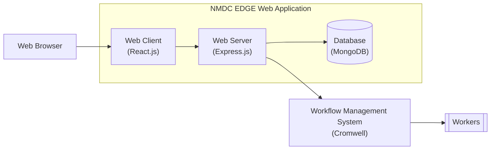

# nmdc-edge

This repository contains the source code of the NMDC EDGE web application.

The NMDC EDGE web application is the web-based interface through which researchers can access the NMDC EDGE platform. 
The NMDC EDGE platform is a [Cromwell](https://cromwell.readthedocs.io/en/stable/)-based system researchers can use to
process omics data using standardized bioinformatics workflows.

You can learn more about the NMDC EDGE platform by reading the [NMDC EDGE tutorials](https://nmdc-edge.org/tutorial).

## Architecture

Here's a diagram depicting the architecture of the NMDC EDGE platform,
including how the NMDC EDGE web application fits into it.

Here's a list of the main technologies upon which the NMDC EDGE web application is built:

- React.js (web client)
- Node.js + Express.js (web server)
- MongoDB (database)

## Development

Coming soon...