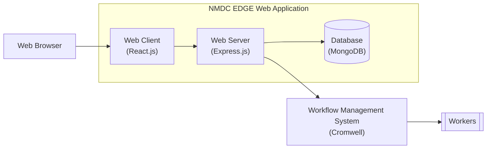
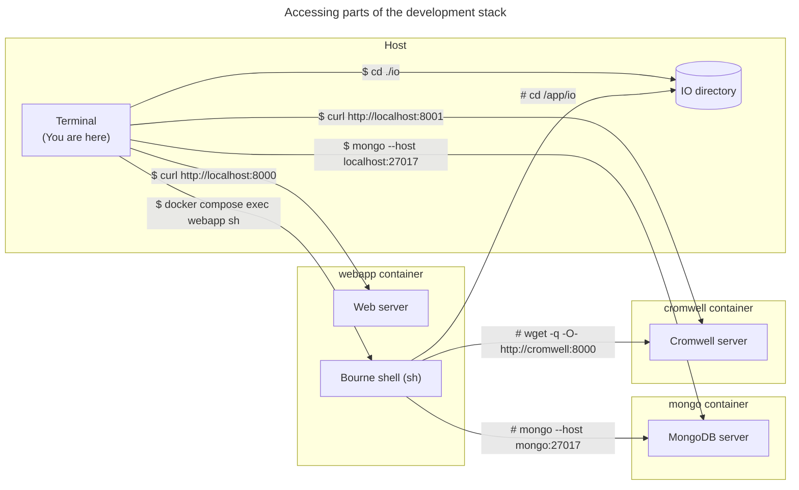

# nmdc-edge

This repository contains the source code of the NMDC EDGE web application.

The NMDC EDGE web application is the web-based interface through which researchers can access the NMDC EDGE platform. 
The NMDC EDGE platform is a [Cromwell](https://cromwell.readthedocs.io/en/stable/)-based system researchers can use to
process omics data using standardized bioinformatics workflows.

You can learn more about the NMDC EDGE platform by reading the [NMDC EDGE tutorials](https://nmdc-edge.org/tutorial).

## Table of contents

<!-- TOC -->
* [nmdc-edge](#nmdc-edge)
  * [Table of contents](#table-of-contents)
  * [Architecture](#architecture)
  * [Development](#development)
    * [Development stack](#development-stack)
      * [Setup](#setup)
        * [Prerequisites](#prerequisites)
        * [Procedure](#procedure)
      * [Usage](#usage)
  * [Deployment](#deployment)
    * [Building and publishing a container image](#building-and-publishing-a-container-image)
    * [Instantiating the container image](#instantiating-the-container-image)
  * [Appendix](#appendix)
<!-- TOC -->

## Architecture

Here's a diagram depicting the architecture of the NMDC EDGE platform,
including how the NMDC EDGE web application fits into it.



Here's a list of the main technologies upon which the NMDC EDGE web application is built:

- [React.js](https://react.dev/) (web client)
- [Node.js](https://nodejs.org/en) + [Express.js](https://expressjs.com/) (web server)
- [MongoDB](https://www.mongodb.com/) (database)

## Development

### Development stack

This repository includes a container-based development stack consisting of three containers:
- `webapp` - runs the NMDC EDGE web application
- `mongo` - runs a MongoDB server
- `cromwell` - runs a Cromwell server

You can use the development stack to run the NMDC EDGE web application locally.

#### Setup

##### Prerequisites

- [Docker](https://www.docker.com/products/docker-desktop/) is installed on your computer.
    - For example, version 24:
      ```shell
      $ docker --version
      Docker version 24.0.6, build ed223bc
      ```
- The "client build" configuration file (i.e. `webapp/client/.env`) is populated.
  - You can initialize it based upon the corresponding example file:
    ```shell
    cp webapp/client/.env.example webapp/client/.env
    ```
    > Those environment variables are used within `webapp/client/src/config.js`.
- The server configuration file (i.e. `webapp/server/.env`) is populated.
  - You can initialize it based upon the corresponding example file:
    ```shell
    cp webapp/server/.env.example webapp/server/.env
    ```
    > Those environment variables are used within `webapp/server/config.js`.

##### Procedure

You can spin up the development stack by running the following command in the root directory of the repository:

```shell
docker compose up
```

> Alternatively, if you've made any changes to the `Dockerfile` since the last time you ran that command,
> run it with the `--build` option so those changes take effect.
> 
> ```shell
> docker compose up --build
> ```
> 
> Note: Building a new container image can take several minutes; whereas starting up an existing container image
> usually takes only a few seconds.

#### Usage

Once the development stack is up and running, you can access various pieces of it from your computer as shown here:



## Deployment

Deploying the NMDC EDGE web app involves doing two things:
1. Building and publishing a container image
2. Instantiating the container image

### Building and publishing a container image

You can build and publish a container image by creating a
[Release](https://github.com/microbiomedata/nmdc-edge/releases)
on GitHub. When a qualifying Release gets created, a
[GitHub Actions workflow](https://github.com/microbiomedata/nmdc-edge/tree/main/.github/workflows)
will automatically run. That workflow will build a container image and publish (push) it to the
[GitHub Container Registry](https://github.com/microbiomedata/nmdc-edge/pkgs/container/nmdc-edge-web-app).
A qualifying Release is any Release whose associated Git tag is a valid
[Semantic Versioning (semver)](https://semver.org/) string (e.g. `v0.1.0-alpha.1`).  

Here's how you can create a qualifying Release:

1. When viewing this repository on GitHub, go to [Releases](https://github.com/microbiomedata/nmdc-edge/releases).
2. Click the "Draft a new release" button.
3. Fill in the form as follows:
   1. Create a tag. Name it with a semantic versioning string.
   2. Click the "Generate release notes" button.
   3. Leave the "Release title" field empty (so GitHub reuses the tag name as the Release title).
   4. Mark the "Set as a pre-release" button.
   5. Click the "Publish release" button.
4. Wait about 5 minutes for the container image to be built and published to the
   [GitHub Container Registry](https://github.com/microbiomedata/nmdc-edge/pkgs/container/nmdc-edge-web-app).
   1. Taking a long time? Check the "Actions" tab on GitHub to see the status of the GitHub Actions workflow that
      builds and publishes the container image.

Once the container image is in the GitHub Container Registry, you can instantiate it.

### Instantiating the container image

You can instantiate the container image by defining some environment variables
and then running `$ docker compose up`, using the production Docker Compose file located at
[`./docs/docker-compose.prod.yml`](https://github.com/microbiomedata/nmdc-edge/blob/main/docs/docker-compose.prod.yml).
You can learn more about the environment variables by reading the comments within the production
Docker Compose file.

## Appendix

### Admin users

Here's how you can make yourself into an admin user (e.g. in order to access admin-only content):

1. Sign into NMDC EDGE via ORCID at least once
2. Use a MongoDB client to connect to the application's MongoDB server
3. Connect to the application's database, by running: `use nmdcedge;`
4. Find the document corresponding to your ORCID account, by running: `db.users.find({ email: "..." });` (replace `...` with your email address). Note that document's `_id` value.
5. Make that user into an admin, by running: `db.users.updateOne({ _id: ... }, { $set: { type: "admin" }});` (replace `...` with the value from the previous step, including the outer `ObjectId()` part).
6. Confirm that user is an admin, by running: `db.users.find({ type: "admin" });`
