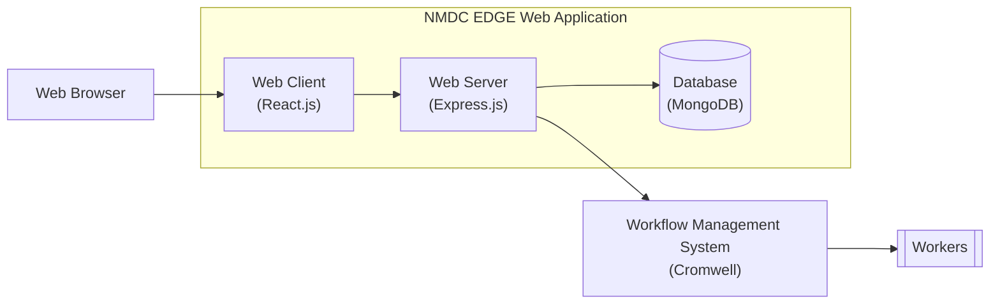
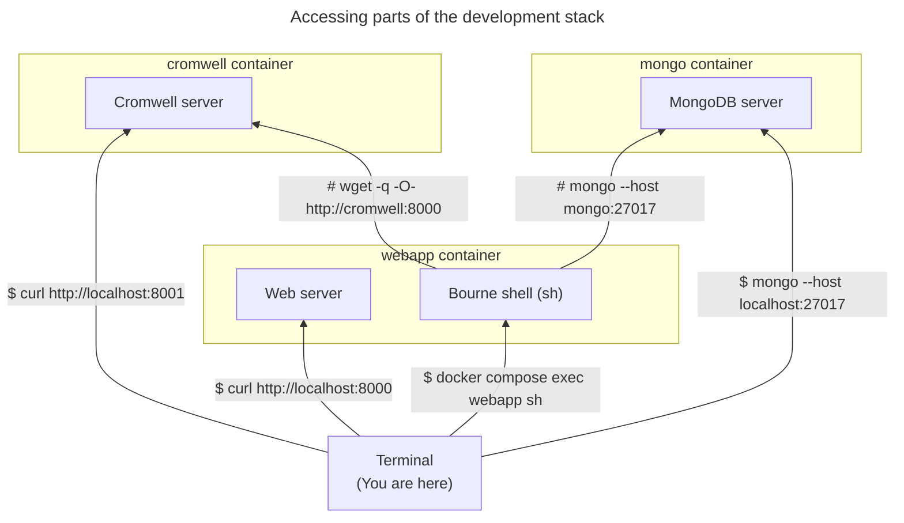

# nmdc-edge

This repository contains the source code of the NMDC EDGE web application.

The NMDC EDGE web application is the web-based interface through which researchers can access the NMDC EDGE platform. 
The NMDC EDGE platform is a [Cromwell](https://cromwell.readthedocs.io/en/stable/)-based system researchers can use to
process omics data using standardized bioinformatics workflows.

You can learn more about the NMDC EDGE platform by reading the [NMDC EDGE tutorials](https://nmdc-edge.org/tutorial).

## Architecture

Here's a diagram depicting the architecture of the NMDC EDGE platform,
including how the NMDC EDGE web application fits into it.



Here's a list of the main technologies upon which the NMDC EDGE web application is built:

- [React.js](https://react.dev/) (web client)
- [Node.js](https://nodejs.org/en) + [Express.js](https://expressjs.com/) (web server)
- [MongoDB](https://www.mongodb.com/) (database)

## Development

### Development stack

This repository includes a container-based development stack consisting of three containers:
- `webapp` - runs the NMDC EDGE web application
- `mongo` - runs a MongoDB server
- `cromwell` - runs a Cromwell server

You can use the development stack to run the NMDC EDGE web application locally.

#### Setup

##### Prerequisites

- [Docker](https://www.docker.com/products/docker-desktop/) is installed on your computer.
    - For example, version 24:
      ```shell
      $ docker --version
      Docker version 24.0.6, build ed223bc
      ```
- The "client build" configuration file (i.e. `webapp/client/.env`) is populated.
  - You can initialize it based upon the corresponding example file:
    ```shell
    cp webapp/client/.env.example \
       webapp/client/.env
    ```
    > Those environment variables are used within `webapp/client/src/config.js`.
- The server configuration file (i.e. `webapp/server/.env`) is populated.
  - You can initialize it based upon the corresponding example file:
    ```shell
    cp webapp/server/.env.example \
       webapp/server/.env
    ```
    > Those environment variables are used within `webapp/server/config.js`.

##### Procedure

You can spin up the development stack by running the following command in the root directory of the repository:

```shell
docker compose up
```

> Alternatively, if you've made any changes to the `Dockerfile` since the last time you ran that command,
> run it with the `--build` option so those changes take effect.
> 
> ```shell
> docker compose up --build
> ```
> 
> Note: Building a new container image can take several minutes; whereas starting up an existing container image
> usually takes only a few seconds.

#### Usage

Once the development stack is up and running, you can access various pieces of it from your computer as shown here:



## Deployment

Coming soon...