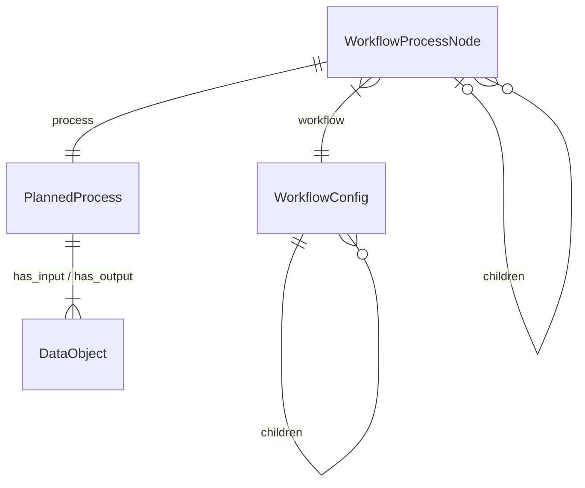
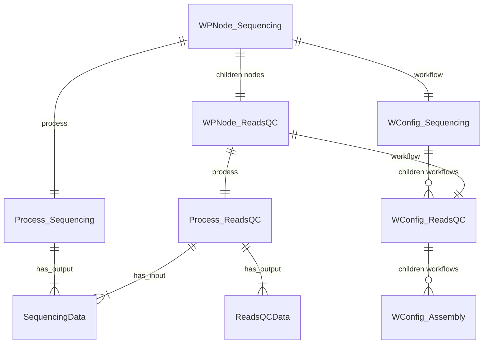

[](https://github.com/microbiomedata/nmdc_automation/actions/workflows/blt.yml)


<!-- Pytest Coverage Comment:Begin -->
<!-- Pytest Coverage Comment:End -->

# nmdc_automation

An automation framework for running sequential metagenome analysis jobs and making the outputs
available as metadata in the NMDC database, and data objects on the NMDC data portal.

## Table of Contents
- [Installation](#installation)
- [Overview](#overview)
  - [System Components](#system-components)
  - [System Configuration](#system-configuration)
- [Instructions (for NERSC / Perlmutter environment)](#instructions-for-nersc--perlmutter-environment)
  - [Running the Scheduler on NERSC Rancher2](#running-the-scheduler-on-nersc-rancher2)
  - [Running the Watcher on NERSC Perlmutter](#running-the-watcher-on-nersc-perlmutter)
    - [Check the Watcher Status](#check-the-watcher-status)
    - [Set-Up and Configuration](#set-up-and-configuration)
    - [Running the Watcher](#running-the-watcher)
    - [Monitoring the Watcher](#monitoring-the-watcher)
      - [JAWS](#jaws)
      - [NMDC Database](#nmdc-database)
      - [Watcher State File](#watcher-state-file)
    - [Handling Failed Jobs](#handling-failed-jobs)


## Installation

### Requirements

- mongodb-community needs to be installed and running on the local machine
- Python 3.11 or later
- Poetry 


Poetry Installation instructions can be found [Here](https://python-poetry.org/docs/#installing-with-pipx)


### MongoDB Installation

Install MongoDB using Homebrew on MacOS:

```bash
brew tap mongodb/brew
brew install mongodb-community
brew services start mongodb-community
```

Full Mongodb installation instructions for Mac can be found [here](https://docs.mongodb.com/manual/tutorial/install-mongodb-on-os-x/)

 Ensure that the mongodb service is running:
```bash
brew services start mongodb-community
```

### Installation

1. Clone the repository
```bash
git clone https://github.com/microbiomedata/nmdc_automation.git
```

2. Install the required packages
```bash
cd nmdc_automation  
poetry install
```

3. Activate the poetry environment
```bash  
poetry env activate
```
OR
```bash
poetry shell
```
Depending on Poetry version

4. Run the tests
```bash
make test
```


## Overview

### System Components


Scheduler
: The Scheduler polls the NMDC database based upon an `Allowlist` of DataGeneration IDs. Based on an allowed 
data-generation ID, the scheduler examines WorkflowExecutions and DataObjects that `was_informed_by` by the 
data generation, and builds a graph of `Workflow Process Nodes`. 

A `Workflow Process Node` is a representation of:
- `workflow` - the workflow configuration, from workflows.yaml. The "recipe" for the given type of analysis
- - `workflow.children` - the child workflow recipes that can be run after this workflow
- `process` - the planned process, from the NMDC database. The "instance" of a workflow execution or data generation from the NMDC database
- `parent` - the parent workflow process node, if any
- `children` - the child workflow process nodes, if any



When the scheduler finds a node where:

1. The node has a workflow configuration in node.workflow.children
2. The node DOES NOT have a child node in node.children
3. The required inputs for the child workflow are available in node's process outputs



In this case the Scheduler will "schedule" a new job by creating a Job configuration from:
- the workflow configuration from node.workflow.children
- input data from node.data_objects
and writing this
to the `jobs` collection in the NMDC database

Watcher
: The Watcher "watches" the `jobs` table in the NMDC database looking for unclaimed jobs. If found, the 
Watcher will create a `WorkflowJob` to manage the analysis job.  The watcher will then periodically poll
each workflow job for its status and process successful or failed jobs when they are complete

WorkflowJob
: A `WorkflowJob` consists of a `WorkflowStateManager` and a `JobRunner` and is responsible for preparing the 
required inputs for an analysis job, submitting it to the job running service.

The default job running service is JAWS:
https://ipo.lbl.gov/joint-genome-institute-analysis-workflow-service-jaws-for-complex-computational-pipelines-on-multiple-compute-resources/

The legacy job running service is a self-managed SLURM/Condor/Cromwell stack running on Permutter. 

Details can be found in [README_Slurm.md](README_Slurm.md)

The `JobRunner` is also responsible for processing the resulting data and metadata when the job completes.  
The watcher maintains a record of it's current activity in a `State File`

### System Configuration

Site Config
: Site-specific configuration is provided by a .toml file and defines some parameters that are used
across the workflow process including

1. URL and credentials for NMDC API
2. Staging and Data filesystem locations for the site
3. Job Runner service URLs
4. Path to the state file

Workflow Definitions
: Workflow definitions in a .yaml file describing each analysis step, specifying:

1. Name, type, version, WDL and git repository for each workflow
2. Inputs, Outputs and Workflow Execution steps
3. Data Object Types, description and name templates for processing workflow output data

---

## Instructions (for NERSC / Perlmutter environment)


### Running the Scheduler on NERSC Rancher2

The Scheduler is a Dockerized application running on [Rancher](https://rancher2.spin.nersc.gov). 
To initialize the Scheduler for new DataGeneration IDs, the following steps:

1. On Rancher, go to `Deployments`, select `Production` from the clusters list, and find the Scheduler in either `nmdc` or `nmdc-dev`
2. Click on the Scheduler and select `run shell`
3. In the shell, `cd /conf`
4. Update the file `allow.lst` with the Data Generation IDs that you want to schedule
   1. Copy the list of data-generation IDs to you clipboard
   2. In the shell, delete the existing allow list `rm allow.lst`
   3. Replace the file with your copied list:
      1. `cat >allow.lst`
      2. Paste your IDs `command-v`
      3. Ensure a blank line at the end with a `return` 
      4. Terminate the cat command using `control-d`
5. The default log level is `INFO` if you want to change it to `DEBUG` for more verbose logging, run the following command:
   1. `export NMDC_LOG_LEVEL=DEBUG`
6. Restart the scheduler.  In the shell, in /conf:  `./run.sh`
7. Ensure the scheduler is running by checking `sched.log`


### Running the Watcher on NERSC Perlmutter

The watcher is a python application which runs on a login node on Perlmutter. 
The following instructions all assume the user is logged in as user `nmdcda@perlmutter.nersc.gov`

1. Get an ssh key - in your home directory: `./sshproxy.sh -u <your_nersc_username> -c nmdcda`
2. Log in using the key `ssh -i .ssh/nmdcda nmdcda@perlmutter.nersc.gov`

Watcher code and config files can be found 
- `/global/homes/n/nmdcda/nmdc_automation/prod`
- `/global/homes/n/nmdcda/nmdc_automation/dev`

#### Check the Watcher Status

1. Check the last node the watcher was running on
```shell
(base) nmdcda@perlmutter:login07:~> cd nmdc_automation/dev
(base) nmdcda@perlmutter:login07:~/nmdc_automation/dev> cat host-dev.last
login24
```
2. ssh to that node
```shell
(base) nmdcda@perlmutter:login07:~/nmdc_automation/dev> ssh login24
```

3. Check for the watcher process
```shell
(base) nmdcda@perlmutter:login24:~> ps aux | grep watcher
nmdcda    115825  0.0  0.0   8236   848 pts/94   S+   09:33   0:00 grep watcher
nmdcda   2044781  0.4  0.0 146420 113668 ?       S    Mar06   5:42 python -m nmdc_automation.run_process.run_workflows watcher --config /global/homes/n/nmdcda/nmdc_automation/prod/site_configuration_nersc_prod.toml --jaws daemon
nmdcda   2044782  0.0  0.0   5504   744 ?        S    Mar06   0:00 tee -a watcher-prod.log
````

4. **IF** we are going to restart the watcher, we need to kill the existing process
```shell
(base) nmdcda@perlmutter:login24:~> kill -9 2044781
```


#### Set-Up and Configuration

1. Ensure you have the latest `nmdc_automation` code.
   1. `cd nmdc_automation`
   2. `git status` / `git switch main` if not on main branch
   3. `git fetch origin`
   4. `git pull`
2. Setup NMDC automation environment with `conda` and `poetry`. 
   1. load conda: `eval "$__conda_setup"`
   2. in the `nmdc_automation` directory: `poetry update`
   3. Install the nmdc_automation project with `poetry install`
   4. `poetry shell` to use the environment

Example setup:
<details><summary>Example Setup</summary>

```bash
(nersc-python) nmdcda@perlmutter:login38:~> pwd
/global/homes/n/nmdcda
(nersc-python) nmdcda@perlmutter:login38:~> cd nmdc_automation/dev/
(nersc-python) nmdcda@perlmutter:login38:~/nmdc_automation/dev> eval "$__conda_setup"
(base) nmdcda@perlmutter:login38:~/nmdc_automation/dev> cd nmdc_automation/
(base) nmdcda@perlmutter:login38:~/nmdc_automation/dev/nmdc_automation> poetry update
Package operations: 0 installs, 18 updates, 0 removals

  • Updating attrs (24.3.0 -> 25.1.0)
  • Updating certifi (2024.12.14 -> 2025.1.31)
  • Updating pydantic (2.10.5 -> 2.10.6)
  • Updating rdflib (7.1.2 -> 7.1.3)
  • Updating referencing (0.35.1 -> 0.36.2)
  • Updating curies (0.10.2 -> 0.10.4)
  • Updating wrapt (1.17.0 -> 1.17.2)
  • Updating deprecated (1.2.15 -> 1.2.18)
  • Updating babel (2.16.0 -> 2.17.0)
  • Updating pymdown-extensions (10.14 -> 10.14.3)
  • Updating beautifulsoup4 (4.12.3 -> 4.13.3)
  • Updating mkdocs-material (9.5.49 -> 9.6.2)
  • Updating linkml (1.8.5 -> 1.8.6)
  • Updating numpy (2.2.1 -> 2.2.2)
  • Updating pymongo (4.10.1 -> 4.11)
  • Updating tzdata (2024.2 -> 2025.1)
  • Updating nmdc-schema (11.2.1 -> 11.3.0)
  • Updating semver (3.0.2 -> 3.0.4)

Writing lock file
(base) nmdcda@perlmutter:login38:~/nmdc_automation/dev/nmdc_automation> poetry install
Installing dependencies from lock file

No dependencies to install or update

Installing the current project: nmdc-automation (0.1.0)
(base) nmdcda@perlmutter:login38:~/nmdc_automation/dev/nmdc_automation> poetry shell
Spawning shell within /global/cfs/cdirs/m3408/nmdc_automation/dev/nmdc_automation/.venv
. /global/cfs/cdirs/m3408/nmdc_automation/dev/nmdc_automation/.venv/bin/activate
(base) nmdcda@perlmutter:login38:~/nmdc_automation/dev/nmdc_automation> . /global/cfs/cdirs/m3408/nmdc_automation/dev/nmdc_automation/.venv/bin/activate
(nmdc-automation-py3.11) (base) nmdcda@perlmutter:login38:~/nmdc_automation/dev/nmdc_automation>
```
</details>


The `poetry shell` command will activate the environment for the current shell session. 
Environment (nmdc-automation-py3.11) will be displayed in the prompt.


#### Running the Watcher

We run the watcher using `nohup` (No Hangup) - this prevents the watcher process from being terminated
when the user's terminal session ends.  This will cause stdout and stderr to be written to a file
names `nohup.out` in addition to being written to the `watcher.log` file.  

1. change to the working `prod` or `dev` directory
- `/global/homes/n/nmdcda/nmdc_automation/prod`
- `/global/homes/n/nmdcda/nmdc_automation/dev`
2. `export NMDC_LOG_LEVEL=INFO`
3. `rm nohup.out`
4. `nohup ./run_dev.sh &` (for dev) OR `nohup ./run_prod.sh &` (for prod)
    
   5. Note: These scripts use the JAWS service to run jobs.  If you want to use SLURM/Condor, use `run_dev_slurm.sh` or `run_prod_slurm.sh`


#### Monitoring the Watcher

Same process as as [Checking the Watcher Status](#check-the-watcher-status)

##### JAWS

JAWS is the default job running service.  It is a Cromwell-based service that runs jobs on NERSC and other compute resources.
Documentation can be found [here](https://jaws-docs.readthedocs.io/en/latest/)'

With the jaws_jobid, you can check the status of the job in the JAWS service

```shell
> jaws status 109288
{
  "compute_site_id": "nmdc",
  "cpu_hours": null,
  "cromwell_run_id": "0fddc559-833e-4e14-9fa5-1e3d485b232d",
  "id": 109288,
  "input_site_id": "nmdc",
  "json_file": "/tmp/tmpeoq9a5p_.json",
  "output_dir": null,
  "result": null,
  "status": "running",
  "status_detail": "The run is being executed; you can check `tasks` for more detail",
  "submitted": "2025-05-01 11:22:45",
  "tag": "nmdc:dgns-11-sm8wyy89/nmdc:wfrqc-11-7fgdsy18.1",
  "team_id": "nmdc",
  "updated": "2025-05-01 11:40:44",
  "user_id": "nmdcda",
  "wdl_file": "/tmp/tmpq0l3fk0n.wdl",
  "workflow_name": "nmdc_rqcfilter",
  "workflow_root": "/pscratch/sd/n/nmjaws/nmdc-prod/cromwell-executions/nmdc_rqcfilter/0fddc559-833e-4e14-9fa5-1e3d485b232d"
}
````


##### NMDC Database

1. Query the `jobs` table in the NMDC database based on `was_informed_by` a specific DataGeneration ID
```shell 
db.getCollection("jobs").find({
    "config.was_informed_by": "nmdc:omprc-11-sdyccb57"
})
```

Similarly, you can query `workflow_executions` to find results based on `was_informed_by` a specific DataGeneration ID

```shell 
db.getCollection("workflow_execution_set").find({
    "was_informed_by": "nmdc:omprc-11-sdyccb57"
})
``` 

2. Job document example
```json
{
    "workflow" : {
        "id" : "Metagenome Assembly: v1.0.9"
    },
    "id" : "nmdc:9380c834-fab7-11ef-b4bd-0a13321f5970",
    "created_at" : "2025-03-06T18:19:43.000+0000",
    "config" : {
        "git_repo" : "https://github.com/microbiomedata/metaAssembly",
        "release" : "v1.0.9",
        "wdl" : "jgi_assembly.wdl",
        "activity_id" : "nmdc:wfmgas-12-k8dxr170.1",
        "activity_set" : "workflow_execution_set",
        "was_informed_by" : "nmdc:omprc-11-sdyccb57",
        "trigger_activity" : "nmdc:wfrqc-12-dvn15085.1",
        "iteration" : 1,
        "input_prefix" : "jgi_metaAssembly",
        "inputs" : {
            "input_files" : "https://data.microbiomedata.org/data/nmdc:omprc-11-sdyccb57/nmdc:wfrqc-12-dvn15085.1/nmdc_wfrqc-12-dvn15085.1_filtered.fastq.gz",
            "proj" : "nmdc:wfmgas-12-k8dxr170.1",
            "shortRead" : false
        },
        "input_data_objects" : [],
        "activity" : {},
        "outputs" : []
    },
    "claims" : [ ]
}
```
Things to note:
- `config.was_informed_by` is the DataGeneration ID that is the root of this job
- `config.trigger_activity` is the WorkflowExecution ID that triggered this job
- `config.inputs` are the inputs to the job
- `claims` a list of workers that have claimed the job. If this list is empty, the job is available to be claimed. 
If the list is not empty, the job is being processed by a worker - example:
```json
{
            "op_id" : "nmdc:sys0z232qf64",
            "site_id" : "NERSC"
        }
```
This refers to the `operation` and `site` that is processing the job.


##### Watcher State File

The watcher maintains a state file with job configuration, metadata and status information. The location of the 
state file is defined in the site configuration file. For dev this location is:
`/global/cfs/cdirs/m3408/var/dev/agent.state`

Example State File Entry:
<details
><summary>Example State File Entry</summary>

```json
{
      "workflow": {
        "id": "Metagenome Assembly: v1.0.9"
      },
      "created_at": "2025-03-06T18:19:43",
      "config": {
        "git_repo": "https://github.com/microbiomedata/metaAssembly",
        "release": "v1.0.9",
        "wdl": "jgi_assembly.wdl",
        "activity_id": "nmdc:wfmgas-12-k8dxr170.1",
        "activity_set": "workflow_execution_set",
        "was_informed_by": "nmdc:omprc-11-sdyccb57",
        "trigger_activity": "nmdc:wfrqc-12-dvn15085.1",
        "iteration": 1,
        "input_prefix": "jgi_metaAssembly",
        "inputs": {
          "input_files": "https://data.microbiomedata.org/data/nmdc:omprc-11-sdyccb57/nmdc:wfrqc-12-dvn15085.1/nmdc_wfrqc-12-dvn15085.1_filtered.fastq.gz",
          "proj": "nmdc:wfmgas-12-k8dxr170.1",
          "shortRead": false
        },
        "input_data_objects": [],
        "activity": {},
        "outputs": []
      },
      "claims": [],
      "opid": "nmdc:sys0z232qf64",
      "done": true,
      "start": "2025-03-06T19:24:52.176365+00:00",
      "cromwell_jobid": "0b138671-824d-496a-b681-24fb6cb207b3",
      "last_status": "Failed",
      "nmdc_jobid": "nmdc:9380c834-fab7-11ef-b4bd-0a13321f5970",
      "failed_count": 3
    }
```

</details>

Similar to a `jobs` record, with these additional things to note:
- `done` is a boolean indicating if the job is complete
- `cromwell_jobid` is the job ID from the Cromwell service
- `last_status` is the last known status of the job - this is updated by the watcher
- `failed_count` is the number of times the job has failed


#### Handling Failed Jobs

Be default, the watcher will retry a failed job 1 additional time via `jaws resubmit`. 
If the job fails again, the watcher will mark the job as `done` and update the status to `Failed`.

Some things to note:

For jobs that have failed for with a transient incomplete data download, these may be resolved by invoking the `jaws download $jaws_jobid` command
