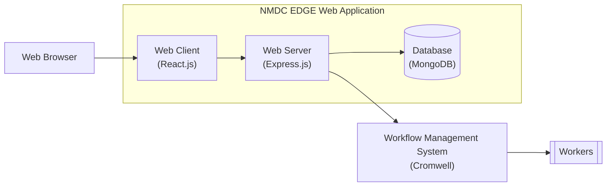
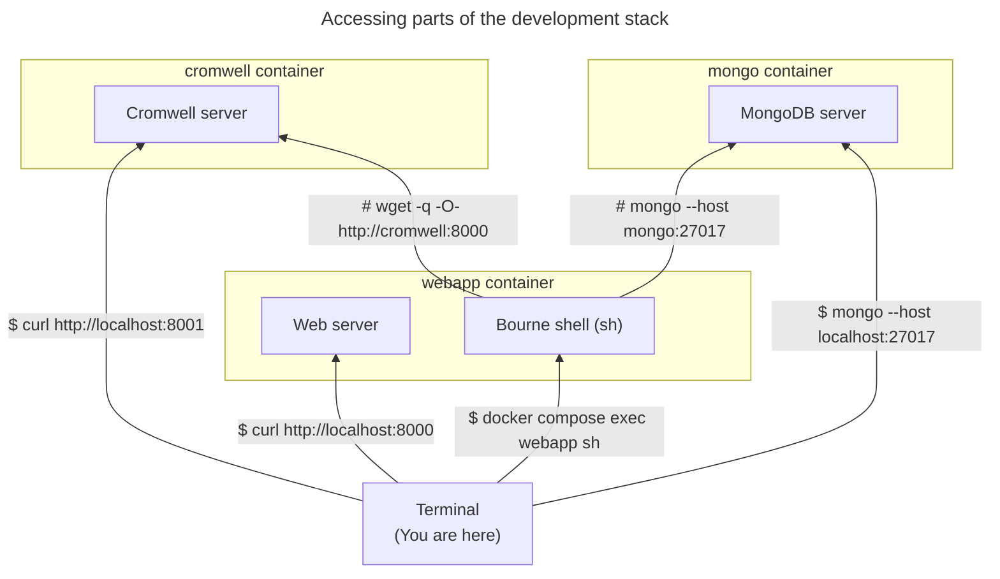

# nmdc-edge

This repository contains the source code of the NMDC EDGE web application.

The NMDC EDGE web application is the web-based interface through which researchers can access the NMDC EDGE platform. 
The NMDC EDGE platform is a [Cromwell](https://cromwell.readthedocs.io/en/stable/)-based system researchers can use to
process omics data using standardized bioinformatics workflows.

You can learn more about the NMDC EDGE platform by reading the [NMDC EDGE tutorials](https://nmdc-edge.org/tutorial).

## Table of contents

* [Architecture](#architecture)
* [Development](#development)
  * [Development stack](#development-stack)
    * [Setup](#setup)
      * [Prerequisites](#prerequisites)
      * [Procedure](#procedure)
    * [Usage](#usage)
* [Deployment](#deployment)
  * [Building and publishing the container image](#building-and-publishing-the-container-image)
    * [Building](#building)
    * [Publishing](#publishing)
      * [References](#references)
  * [Instantiating the container image](#instantiating-the-container-image)

## Architecture

Here's a diagram depicting the architecture of the NMDC EDGE platform,
including how the NMDC EDGE web application fits into it.



Here's a list of the main technologies upon which the NMDC EDGE web application is built:

- [React.js](https://react.dev/) (web client)
- [Node.js](https://nodejs.org/en) + [Express.js](https://expressjs.com/) (web server)
- [MongoDB](https://www.mongodb.com/) (database)

## Development

### Development stack

This repository includes a container-based development stack consisting of three containers:
- `webapp` - runs the NMDC EDGE web application
- `mongo` - runs a MongoDB server
- `cromwell` - runs a Cromwell server

You can use the development stack to run the NMDC EDGE web application locally.

#### Setup

##### Prerequisites

- [Docker](https://www.docker.com/products/docker-desktop/) is installed on your computer.
    - For example, version 24:
      ```shell
      $ docker --version
      Docker version 24.0.6, build ed223bc
      ```
- The "client build" configuration file (i.e. `webapp/client/.env`) is populated.
  - You can initialize it based upon the corresponding example file:
    ```shell
    cp webapp/client/.env.example webapp/client/.env
    ```
    > Those environment variables are used within `webapp/client/src/config.js`.
- The server configuration file (i.e. `webapp/server/.env`) is populated.
  - You can initialize it based upon the corresponding example file:
    ```shell
    cp webapp/server/.env.example webapp/server/.env
    ```
    > Those environment variables are used within `webapp/server/config.js`.

##### Procedure

You can spin up the development stack by running the following command in the root directory of the repository:

```shell
docker compose up
```

> Alternatively, if you've made any changes to the `Dockerfile` since the last time you ran that command,
> run it with the `--build` option so those changes take effect.
> 
> ```shell
> docker compose up --build
> ```
> 
> Note: Building a new container image can take several minutes; whereas starting up an existing container image
> usually takes only a few seconds.

#### Usage

Once the development stack is up and running, you can access various pieces of it from your computer as shown here:



## Deployment

### Building and publishing the container image

Here's how you can build and deploy new versions of the `webapp` container image.

#### Building

You can build a new version of the `webapp` container image by issuing one of the following commands:

- If the architecture of the computer you're using to build the image, and the architecture of the computer on which 
  containers based upon the image will run, are the **same** (e.g. both are arm64, or both are AMD64); then you can use
  this command to build the image (replace `{some_tag}` with a unique identifier for this version, such as `v1.2.3`):
  ```shell
  docker build -f webapp-node18.Dockerfile \
               -t nmdc-edge-web-app:{some_tag} .
  ```
  For example:
  ```console
  $ docker build -f webapp-node18.Dockerfile -t nmdc-edge-web-app:v1.2.3 .
  ```
- If the architecture of the computer you're using to build the image is **arm64** (e.g. an M1 Mac), and the
  architecture of the computer on which containers based upon the image will run is **AMD64**; then you can use _this_
  command to build the image (replace `{some_tag}` with a unique identifier for this version, such as `v1.2.3`):
  ```shell
  docker buildx build --platform linux/amd64 \
                      -f webapp-node18.Dockerfile \
                      -t nmdc-edge-web-app:some-tag .
  ```
  For example:
  ```console
  $ docker buildx build --platform linux/amd64 -f webapp-node18.Dockerfile -t nmdc-edge-web-app:v1.2.3 .
  ```  

#### Publishing

Here's how you can publish the newly-built container image to 
[GitHub Container Registry (GHCR)](https://docs.github.com/en/packages/working-with-a-github-packages-registry/working-with-the-container-registry).

1. Get the ID of the newly-built container image.
   ```shell
   docker images
   ```
   For example:
   ```console
   $ docker images
   REPOSITORY         TAG     IMAGE ID      CREATED       SIZE
   ...
   nmdc-edge-web-app  v1.2.3  365743f24303  1 minute ago  1.35GB
   ...
   ```
2. Give the container image a tag that begins with `ghcr.io/microbiomedata/nmdc-edge-web-app` (replace `{image_id}` with the ID of the container image).
   ```shell
   docker tag {image_id} ghcr.io/microbiomedata/nmdc-edge-web-app:some-tag
   ```
   For example:
   ```console
   $ docker tag 365743f24303 ghcr.io/microbiomedata/nmdc-edge-web-app:v1.2.3
   ```
3. Upload the container image to GitHub Container Registry (GHCR):
   ```shell
   docker push ghcr.io/microbiomedata/nmdc-edge-web-app:some-tag
   ```
   For example:
   ```console
   $ docker push ghcr.io/microbiomedata/nmdc-edge-web-app:v1.2.3
   ```
4. Verify the container image is listed on 
   [GHCR](https://github.com/orgs/microbiomedata/packages/container/package/nmdc-edge-web-app).

##### References

- https://github.com/orgs/microbiomedata/packages/container/package/nmdc-edge-web-app
- https://docs.github.com/en/packages/working-with-a-github-packages-registry/working-with-the-container-registry

### Instantiating the container image

_Coming soon..._
