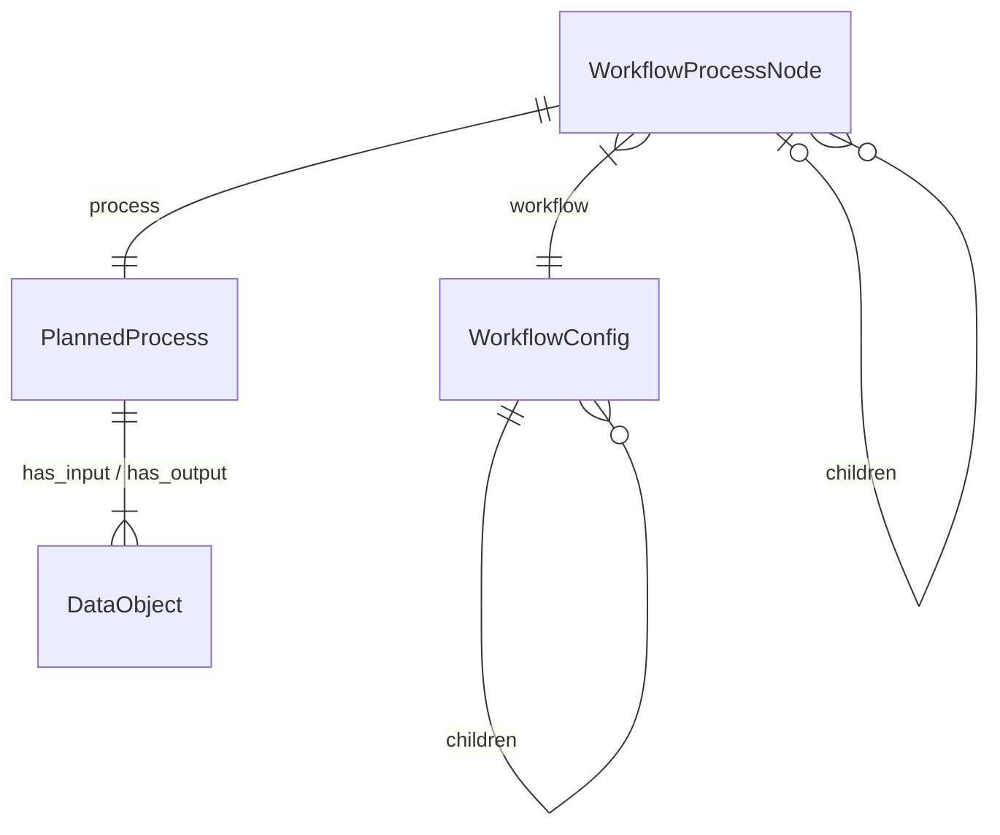
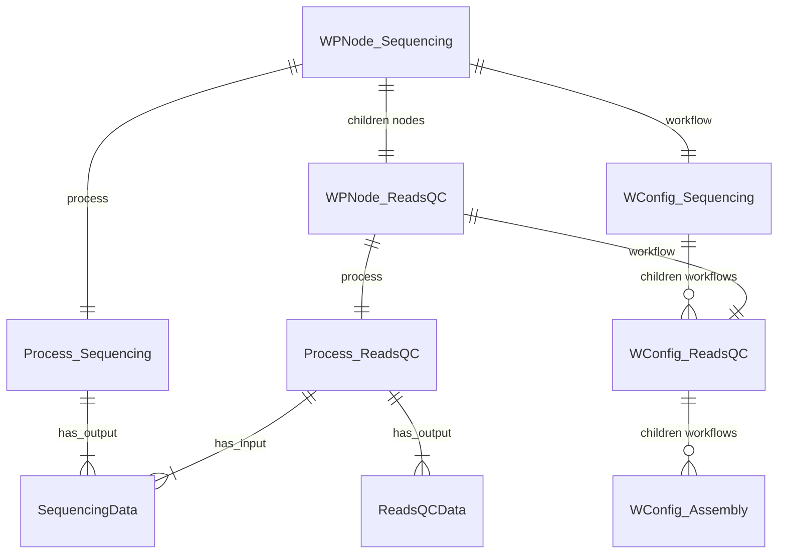

[](https://github.com/microbiomedata/nmdc_automation/actions/workflows/blt.yml)


<!-- Pytest Coverage Comment:Begin -->
<!-- Pytest Coverage Comment:End -->

# nmdc_automation

An automation framework for running sequential metagenome analysis jobs and making the outputs
available as metadata in the NMDC database, and data objects on the NMDC data portal.

## Installation

### Requirements

- mongodb-community needs to be installed and running on the local machine
- Python 3.11 or later


### MongoDB Installation

Install MongoDB using Homebrew on MacOS:

```bash
brew tap mongodb/brew
brew install mongodb-community
brew services start mongodb-community
```

Full Mongodb installation instructions for Mac can be found [here](https://docs.mongodb.com/manual/tutorial/install-mongodb-on-os-x/)

 Ensure that the mongodb service is running:
```bash
brew services start mongodb-community
```

### Installation

1. Clone the repository
```bash
git clone https://github.com/microbiomedata/nmdc_automation.git
```

2. Install the required packages
```bash
cd nmdc_automation  
poetry install
```

3. Activate the poetry environment
```bash  
poetry env activate
```

4. Run the tests
```bash
make test
```


## Overview

### System Components


Scheduler
: The Scheduler polls the NMDC database based upon an `Allowlist` of DataGeneration IDs. Based on an allowed 
data-generation ID, the scheduler examines WorkflowExecutions and DataObjects that `was_informed_by` by the 
data generation, and builds a graph of `Workflow Process Nodes`. 

A `Workflow Process Node` is a representation of:
- `workflow` - the workflow configuration, from workflows.yaml. The "recipe" for the given type of analysis
- - `workflow.children` - the child workflow recipes that can be run after this workflow
- `process` - the planned process, from the NMDC database. The "instance" of a workflow execution or data generation from the NMDC database
- `parent` - the parent workflow process node, if any
- `children` - the child workflow process nodes, if any



When the scheduler finds a node where:

1. The node has a workflow configuration in node.workflow.children
2. The node DOES NOT have a child node in node.children
3. The required inputs for the child workflow are available in node's process outputs



In this case the Scheduler will "schedule" a new job by creating a Job configuration from:
- the workflow configuration from node.workflow.children
- input data from node.data_objects
and writing this
to the `jobs` collection in the NMDC database

Watcher
: The Watcher "watches" the `jobs` table in the NMDC database looking for unclaimed jobs. If found, the 
Watcher will create a `WorkflowJob` to manage the analysis job.  The watcher will then periodically poll
each workflow job for its status and process successful or failed jobs when they are complete

WorkflowJob
: A `WorkflowJob` consists of a `WorkflowStateManager` and a `JobRunner` and is responsible for preparing the 
required inputs for an analysis job, submitting it to the job running service (e.g., J.A.W.S, Cromwell) and 
for processing the resulting data and metadata when the job completes.  The watcher maintains a record of it's
current activity in a `State File`

### System Configuration

Site Config
: Site-specific configuration is provided by a .toml file and defines some parameters that are used
across the workflow process including

1. URL and credentials for NMDC API
2. Staging and Data filesystem locations for the site
3. Job Runner service URLs
4. Path to the state file

Workflow Definitions
: Workflow definitions in a .yaml file describing each analysis step, specifying:

1. Name, type, version, WDL and git repository for each workflow
2. Inputs, Outputs and Workflow Execution steps
3. Data Object Types, description and name templates for processing workflow output data

---

## Instructions (for NERSC / Perlmutter environment)


### Running the Scheduler on NERSC Rancher2

The Scheduler is a Dockerized application running on [Rancher](https://rancher2.spin.nersc.gov). 
To initialize the Scheduler for new DataGeneration IDs, the following steps:

1. On Rancher, go to `Deployments`, select `Production` from the clusters list, and find the Scheduler in either `nmdc` or `nmdc-dev`
2. Click on the Scheduler and select `run shell`
3. In the shell, `cd /conf`
4. Update the file `allow.lst` with the Data Generation IDs that you want to schedule
   1. Copy the list of data-generation IDs to you clipboard
   2. In the shell, delete the existing allow list `rm allow.lst`
   3. Replace the file with your copied list:
      1. `cat >allow.lst`
      2. Paste your IDs `command-v`
      3. Ensure a blank line at the end with a `return` 
      4. Terminate the cat command using `control-d`
5. Recommended to set the log level to INFO or you get a *very* large log output
   1. `export NMDC_LOG_LEVEL=INFO`
6. Restart the scheduler.  In the shell, in /conf:  `./run.sh`
7. Ensure the scheduler is running by checking `sched.log`


### Running the Watcher on NERSC Perlmutter

The watcher is a python application which runs on a login node on Perlmutter. 
The following instructions all assume the user is logged in as user `nmdcda@perlmutter.nersc.gov`

1. Get an ssh key - in your home directory: `./sshproxy.sh -u <your_nersc_username> -c nmdcda`
2. Log in using the key `ssh -i .ssh/nmdcda nmdcda@perlmutter.nersc.gov`

Watcher code and config files can be found 
- `/global/homes/n/nmdcda/nmdc_automation/prod`
- `/global/homes/n/nmdcda/nmdc_automation/dev`

#### Check the Watcher Status

1. Check the last node the watcher was running on
```shell
(base) nmdcda@perlmutter:login07:~> cd nmdc_automation/dev
(base) nmdcda@perlmutter:login07:~/nmdc_automation/dev> cat host-dev.last
login24
```
2. ssh to that node
```shell
(base) nmdcda@perlmutter:login07:~/nmdc_automation/dev> ssh login24
```

3. Check for the watcher process
```shell
(base) nmdcda@perlmutter:login24:~> ps aux | grep watcher
nmdcda    115825  0.0  0.0   8236   848 pts/94   S+   09:33   0:00 grep watcher
nmdcda   2044781  0.4  0.0 146420 113668 ?       S    Mar06   5:42 python -m nmdc_automation.run_process.run_workflows watcher --config /global/homes/n/nmdcda/nmdc_automation/prod/site_configuration_nersc_prod.toml daemon
nmdcda   2044782  0.0  0.0   5504   744 ?        S    Mar06   0:00 tee -a watcher-prod.log
````

4. **IF** we are going to restart the watcher, we need to kill the existing process
```shell
(base) nmdcda@perlmutter:login24:~> kill -9 2044781
```


#### Set-Up and Configuration

1. Ensure you have the latest `nmdc_automation` code.
   1. `cd nmdc_automation`
   2. `git status` / `git switch main` if not on main branch
   3. `git fetch origin`
   4. `git pull`
2. Setup NMDC automation environment with `conda` and `poetry`. 
   1. load conda: `eval "$__conda_setup"`
   2. in the `nmdc_automation` directory: `poetry update`
   3. Install the nmdc_automation project with `poetry install`
   4. `poetry shell` to use the environment

Example setup:
```bash
(nersc-python) nmdcda@perlmutter:login38:~> pwd
/global/homes/n/nmdcda
(nersc-python) nmdcda@perlmutter:login38:~> cd nmdc_automation/dev/
(nersc-python) nmdcda@perlmutter:login38:~/nmdc_automation/dev> eval "$__conda_setup"
(base) nmdcda@perlmutter:login38:~/nmdc_automation/dev> cd nmdc_automation/
(base) nmdcda@perlmutter:login38:~/nmdc_automation/dev/nmdc_automation> poetry update
Package operations: 0 installs, 18 updates, 0 removals

  • Updating attrs (24.3.0 -> 25.1.0)
  • Updating certifi (2024.12.14 -> 2025.1.31)
  • Updating pydantic (2.10.5 -> 2.10.6)
  • Updating rdflib (7.1.2 -> 7.1.3)
  • Updating referencing (0.35.1 -> 0.36.2)
  • Updating curies (0.10.2 -> 0.10.4)
  • Updating wrapt (1.17.0 -> 1.17.2)
  • Updating deprecated (1.2.15 -> 1.2.18)
  • Updating babel (2.16.0 -> 2.17.0)
  • Updating pymdown-extensions (10.14 -> 10.14.3)
  • Updating beautifulsoup4 (4.12.3 -> 4.13.3)
  • Updating mkdocs-material (9.5.49 -> 9.6.2)
  • Updating linkml (1.8.5 -> 1.8.6)
  • Updating numpy (2.2.1 -> 2.2.2)
  • Updating pymongo (4.10.1 -> 4.11)
  • Updating tzdata (2024.2 -> 2025.1)
  • Updating nmdc-schema (11.2.1 -> 11.3.0)
  • Updating semver (3.0.2 -> 3.0.4)

Writing lock file
(base) nmdcda@perlmutter:login38:~/nmdc_automation/dev/nmdc_automation> poetry install
Installing dependencies from lock file

No dependencies to install or update

Installing the current project: nmdc-automation (0.1.0)
(base) nmdcda@perlmutter:login38:~/nmdc_automation/dev/nmdc_automation> poetry shell
Spawning shell within /global/cfs/cdirs/m3408/nmdc_automation/dev/nmdc_automation/.venv
. /global/cfs/cdirs/m3408/nmdc_automation/dev/nmdc_automation/.venv/bin/activate
(base) nmdcda@perlmutter:login38:~/nmdc_automation/dev/nmdc_automation> . /global/cfs/cdirs/m3408/nmdc_automation/dev/nmdc_automation/.venv/bin/activate
(nmdc-automation-py3.11) (base) nmdcda@perlmutter:login38:~/nmdc_automation/dev/nmdc_automation>
```
The `poetry shell` command will activate the environment for the current shell session. 
Environment (nmdc-automation-py3.11) will be displayed in the prompt.


#### Running the Watcher

We run the watcher using `nohup` (No Hangup) - this prevents the watcher process from being terminated
when the user's terminal session ends.  This will cause stdout and stderr to be written to a file
names `nohup.out` in addition to being written to the `watcher.log` file.  

1. change to the working `prod` or `dir` directory
- `/global/homes/n/nmdcda/nmdc_automation/prod`
- `/global/homes/n/nmdcda/nmdc_automation/dev`
2. `export NMDC_LOG_LEVEL=INFO`
3. `rm nohup.out`
4. `nohup ./run_dev.sh &` (for dev) OR `nohup ./run_prod.sh &` (for prod)

#### Provision Workers

1. `sbatch ~/workers_perlmutter.sl`

- `sbatch` is the command to submit a job to the Slurm scheduler
- `~/workers_perlmutter.sl` is the script that will be run by the scheduler which specifies the number of workers to provision

```bash
#!/bin/sh
#SBATCH -N 1
#SBATCH -q regular
#SBATCH -t 12:00:00
#SBATCH -J nmdc_condor_wrk
#SBATCH -C cpu
```

#### Monitoring the Watcher

1. The watcher writes a file `host-prod.last` in `nmdc_automation/prod` or `nmdc_auotmation/dev` showing which node it is running on
2. ssh to that node
```shell
(base) nmdcda@perlmutter:login07:~> cd nmdc_automation/dev
(base) nmdcda@perlmutter:login07:~/nmdc_automation/dev> cat host-dev.last 
login24
(base) nmdcda@perlmutter:login07:~/nmdc_automation/dev> ssh login24
```
3. Search for the Watcher process `ps aux | grep watcher`

#### Monitoring Jobs

##### Slurm and Condor

- `sqs` Shows the Slurm queue
```shell
JOBID            ST USER      NAME          NODES TIME_LIMIT       TIME  SUBMIT_TIME          QOS             START_TIME           FEATURES       NODELIST(REASON
35153609         PD nmdcda    condor        1     14-00:00:00       0:00  2025-01-23T09:33:27  workflow        N/A                  cron           (Dependency)   
35153610         R  nmdcda    cromwell      1     4-00:00:00 3-11:09:43  2025-02-08T22:07:23  workflow        2025-02-08T22:08:01  cron           login05        
30091486         R  nmdcda    condor        1     14-00:00:00 11-11:13:11  2025-01-27T09:09:48  workflow        2025-01-31T22:04:33  cron           login04
```
Shows a new job with ID 35153609 in the queue (Pending State), and a running job with ID 35153610
- `cq running` Shows which jobs are being run by Condor
```shell
7d07b3e5-edb2-414f-ba19-c570669f3b5f  f_annotate     65ce4da9-52eb-4d74-82e1-9b2b639e694a  65ce4da9-52eb-4d74-82e1-9b2b639e694a  Running   2024-03-27T00:02:34.316Z
```

##### NMDC Database

1. Query the `jobs` table in the NMDC database based on `was_informed_by` a specific DataGeneration ID
```shell 
db.getCollection("jobs").find({
    "config.was_informed_by": "nmdc:omprc-11-sdyccb57"
})
```

Similarly, you can query `workflow_executions` to find results based on `was_informed_by` a specific DataGeneration ID

```shell 
db.getCollection("workflow_execution_set").find({
    "was_informed_by": "nmdc:omprc-11-sdyccb57"
})
``` 

2. Job document example
```json
{
    "workflow" : {
        "id" : "Metagenome Assembly: v1.0.9"
    },
    "id" : "nmdc:9380c834-fab7-11ef-b4bd-0a13321f5970",
    "created_at" : "2025-03-06T18:19:43.000+0000",
    "config" : {
        "git_repo" : "https://github.com/microbiomedata/metaAssembly",
        "release" : "v1.0.9",
        "wdl" : "jgi_assembly.wdl",
        "activity_id" : "nmdc:wfmgas-12-k8dxr170.1",
        "activity_set" : "workflow_execution_set",
        "was_informed_by" : "nmdc:omprc-11-sdyccb57",
        "trigger_activity" : "nmdc:wfrqc-12-dvn15085.1",
        "iteration" : 1,
        "input_prefix" : "jgi_metaAssembly",
        "inputs" : {
            "input_files" : "https://data.microbiomedata.org/data/nmdc:omprc-11-sdyccb57/nmdc:wfrqc-12-dvn15085.1/nmdc_wfrqc-12-dvn15085.1_filtered.fastq.gz",
            "proj" : "nmdc:wfmgas-12-k8dxr170.1",
            "shortRead" : false
        },
        "input_data_objects" : [],
        "activity" : {},
        "outputs" : []
    },
    "claims" : [ ]
}
```
Things to note:
- `config.was_informed_by` is the DataGeneration ID that is the root of this job
- `config.trigger_activity` is the WorkflowExecution ID that triggered this job
- `config.inputs` are the inputs to the job
- `claims` a list of workers that have claimed the job. If this list is empty, the job is available to be claimed. 
If the list is not empty, the job is being processed by a worker - example:
```json
{
            "op_id" : "nmdc:sys0z232qf64",
            "site_id" : "NERSC"
        }
```
This refers to the `operation` and `site` that is processing the job.


##### Watcher State File

The watcher maintains a state file with job configuration, metadata and status information. The location of the 
state file is defined in the site configuration file. For dev this location is:
`/global/cfs/cdirs/m3408/var/dev/agent.state`

Example State File Entry:
```json
{
      "workflow": {
        "id": "Metagenome Assembly: v1.0.9"
      },
      "created_at": "2025-03-06T18:19:43",
      "config": {
        "git_repo": "https://github.com/microbiomedata/metaAssembly",
        "release": "v1.0.9",
        "wdl": "jgi_assembly.wdl",
        "activity_id": "nmdc:wfmgas-12-k8dxr170.1",
        "activity_set": "workflow_execution_set",
        "was_informed_by": "nmdc:omprc-11-sdyccb57",
        "trigger_activity": "nmdc:wfrqc-12-dvn15085.1",
        "iteration": 1,
        "input_prefix": "jgi_metaAssembly",
        "inputs": {
          "input_files": "https://data.microbiomedata.org/data/nmdc:omprc-11-sdyccb57/nmdc:wfrqc-12-dvn15085.1/nmdc_wfrqc-12-dvn15085.1_filtered.fastq.gz",
          "proj": "nmdc:wfmgas-12-k8dxr170.1",
          "shortRead": false
        },
        "input_data_objects": [],
        "activity": {},
        "outputs": []
      },
      "claims": [],
      "opid": "nmdc:sys0z232qf64",
      "done": true,
      "start": "2025-03-06T19:24:52.176365+00:00",
      "cromwell_jobid": "0b138671-824d-496a-b681-24fb6cb207b3",
      "last_status": "Failed",
      "nmdc_jobid": "nmdc:9380c834-fab7-11ef-b4bd-0a13321f5970",
      "failed_count": 3
    }
```
Similar to a `jobs` record, with these additional things to note:
- `done` is a boolean indicating if the job is complete
- `cromwell_jobid` is the job ID from the Cromwell service
- `last_status` is the last known status of the job - this is updated by the watcher
- `failed_count` is the number of times the job has failed

##### Cromwell Job Status and Metadata

With the cromwell_jobid, you can query the Cromwell service for the status of the job - the Cromwell service URL is
defined in the site configuration file.

```shell
curl --netrc https://nmdc-cromwell.freeddns.org:8443/api/workflows/v1/0b138671-824d-496a-b681-24fb6cb207b3/status
{"status":"Failed","id":"0b138671-824d-496a-b681-24fb6cb207b3"}
```
Job Metadata can be found in the Cromwell service by querying the metadata endpoint

```shell
curl --netrc https://nmdc-cromwell.freeddns.org:8443/api/workflows/v1/0b138671-824d-496a-b681-24fb6cb207b3/metadata
```
This will include the inputs, outputs and logs for the job, as well as failure information if the job failed.
```json
{
     "status": "Failed",
  "failures": [
    {
      "causedBy": [
        {
          "causedBy": [],
          "message": "Failed to evaluate input 'input_files' (reason 1 of 1): No coercion defined from '\"https://data.microbiomedata.org/data/nmdc:omprc-11-sdyccb57/nmdc:wfrqc-12-dvn15085.1/nmdc_wfrqc-12-dvn15085.1_filtered.fastq.gz\"' of type 'spray.json.JsString' to 'Array[File]'."
        }
      ],
      "message": "Workflow input processing failed"
    }
  ]
}
```

#### Handling Failed Jobs
NOTE: This is currently a manual process and should be used with caution.  We are working on a more automated solution.

Forcing the Scheduler to create a new job for a specific DataGeneration ID can be done by deleting the existing job from the `jobs` collection.
We would want to do this if the job failed because of a configuration error, and we have fixed the configuration and
would want to create a new job with the updated configuration.

Forcing the Watcher to re-claim and re-run a job can be done by deleting the operation from the `operations` collection
and deleting the op_id and site_id from the `claims` array in the job document in the `jobs` collection. We would want
to do this if the job failed because of a transient error, and we want to re-run the job with the same configuration.


### Importing External Projects into the NMDC Database

#### Setup and Configuration
Import automation code and config files can be found
- `/global/homes/n/nmdcda/nmdc_automation/prod`
- `/global/homes/n/nmdcda/nmdc_automation/dev`

1. Get the appropriate branch latest code from the nmdc_automation repo
- in prod or dev `nmcd_automation` directory:
- switch to the branch you want to run the code from - in this case `main`
```bash
(nmdc-automation-py3.11) (base) nmdcda@perlmutter:login38:~/nmdc_automation/dev/nmdc_automation> git status
On branch main
Your branch is up to date with 'origin/main'.
```
- fetch the latest code from the branch
```bash
(nmdc-automation-py3.11) (base) nmdcda@perlmutter:login38:~/nmdc_automation/dev/nmdc_automation> git fetch origin
Unpacking objects: 100% (87/87), 27.19 KiB | 7.00 KiB/s, done.
From github.com:microbiomedata/nmdc_automation
   f313647..89b64f0  332-issues-with-rerunning-import-automation         -> origin/332-issues-with-rerunning-import-automation
(nmdc-automation-py3.11) (base) nmdcda@perlmutter:login38:~/nmdc_automation/dev/nmdc_automation> git pull
Already up to date.
```
2. Activate the nmdcda conda environment
- logged in as `nmdcda` user. Can be run in nmdcda home directory (or any other directory)
```bash
(nersc-python) nmdcda@perlmutter:login16:~> eval "$__conda_setup"
(base) nmdcda@perlmutter:login16:~>
```
3. Run `poetry install` to install the required packages
- in the `nmdc_automation` directory in the `dev` or `prod` directory
```bash
(base) nmdcda@perlmutter:login16:~/nmdc_automation/dev/nmdc_automation> poetry install
Installing dependencies from lock file

No dependencies to install or update

Installing the current project: nmdc-automation (0.1.0)
```

4. Run `poetry shell` to activate the poetry environment
```bash
(base) nmdcda@perlmutter:login16:~/nmdc_automation/dev/nmdc_automation> poetry shell
Spawning shell within /global/cfs/cdirs/m3408/nmdc_automation/dev/nmdc_automation/.venv
. /global/cfs/cdirs/m3408/nmdc_automation/dev/nmdc_automation/.venv/bin/activate
bash: __add_sys_prefix_to_path: command not found
bash: __add_sys_prefix_to_path: command not found
To load conda do: eval "$__conda_setup"
(base) nmdcda@perlmutter:login16:~/nmdc_automation/dev/nmdc_automation> . /global/cfs/cdirs/m3408/nmdc_automation/dev/nmdc_automation/.venv/bin/activate
(nmdc-automation-py3.11) (base) nmdcda@perlmutter:login16:~/nmdc_automation/dev/nmdc_automation> 
```


#### Running the Import Process

 Required files:
- import.tsv in the following format:

| nucleotide_sequencing_id | project_id | project_path |
|----------|------------|-----------|
|nmdc:omprc-11-q8b9dh63 | Ga0597031  | /path/to/project/Ga0597031 |

- import.yaml
Specifies import parameters for:
- - Workflows
```text
  - Name: Reads QC
    Import: true
    Type: nmdc:ReadQcAnalysis
    Git_repo: https://github.com/microbiomedata/ReadsQC
    Version: v1.0.14
    Collection: workflow_execution_set
    WorkflowExecutionRange: ReadQcAnalysis
    Inputs:
      - Metagenome Raw Reads
    Workflow_Execution:
      name: "Read QC for {id}"
      input_read_bases: "{outputs.stats.input_read_bases}"
      input_read_count: "{outputs.stats.input_read_count}"
      output_read_bases: "{outputs.stats.output_read_bases}"
      output_read_count: "{outputs.stats.output_read_count}"
      type: nmdc:ReadQcAnalysis
    Outputs:
      - Filtered Sequencing Reads
      - QC Statistics
```
- - Data Objects
```text
    - data_object_type: Clusters of Orthologous Groups (COG) Annotation GFF
      description: COGs for {id}
      name: GFF3 format file with COGs
      import_suffix: _cog.gff
      nmdc_suffix: _cog.gff
      input_to: [nmdc:MagsAnalysis]
      output_of: nmdc:MetagenomeAnnotation
      multiple: false
      action: rename
```
- - Workflow Metadata
```text
Workflow Metadata:
  Execution Resource: JGI
  Source URL: https://data.microbiomedata.org/data
  Root Directory: /global/cfs/cdirs/m3408/ficus/pipeline_products
```

- site_configuration.toml
- - Contains the following configurations:
```text
[credentials]
client_id = "sys0wm66"
client_secret = xxxxx
```
```text
[nmdc]
url_root = "https://data.microbiomedata.org/data/"
api_url = "http://localhost:8000"
```

#### Running the Import Process
- Run the import process *without* updating the database (--update-db flag is not used):
```bash
(nmdc-automation-py3.11) (base) nmdcda@perlmutter:login16:~/nmdc_automation/dev> python nmdc_automation/nmdc_automation/run_process/run_import.py import-projects import_projects/import.tsv nmdc_automation/configs/import.yaml site_configuration_nersc.toml
```
- Examine the log output to ensure that the import process ran successfully
```bash
2025-02-06 12:25:23,507 INFO: Importing project from import_projects/import.tsv
2025-02-06 12:25:23,507 INFO: Import Specifications:  from nmdc_automation/configs/import.yaml
2025-02-06 12:25:23,507 INFO: Site Configuration:  from site_configuration_nersc.toml
2025-02-06 12:25:23,508 INFO: Importing project /global/cfs/cdirs/m3408/aim2/dev/1000_soils/1000_soils_analysis_projects/Ga0533572 into nmdc:omprc-12-hgksne68
2025-02-06 12:25:23,640 INFO: https://api-dev.microbiomedata.org/planned_processes?filter=id%3Anmdc%3Aomprc-12-hgksne68&per_page=100
2025-02-06 12:25:24,255 INFO: https://api-dev.microbiomedata.org/planned_processes?filter=was_informed_by%3Anmdc%3Aomprc-12-hgksne68&per_page=100
2025-02-06 12:25:25,592 WARNING: Cannot find an import specification for data object nmdc:dobj-11-e1xj1y83 / Error Corrected Reads
2025-02-06 12:25:25,594 ERROR: No mapping action found for Ga0533572_crt.out
2025-02-06 12:25:25,594 ERROR: No mapping action found for 52710.1.424012.TACACGCT-TACACGCT.filter_cmd-METAGENOME.sh
2025-02-06 12:25:25,594 ERROR: No mapping action found for Table_2_Sample_Information_1362294.txt
2025-02-06 12:25:25,594 ERROR: No mapping action found for Ga0533572_prodigal_proteins.faa
2025-02-06 12:25:25,594 ERROR: No mapping action found for Ga0533572_annotation_config.yaml
2025-02-06 12:25:25,594 ERROR: No mapping action found for 52710.1.424012.TACACGCT-TACACGCT.QC.pdf
2025-02-06 12:25:25,594 ERROR: No mapping action found for Ga0533572_prodigal.out
2025-02-06 12:25:25,594 ERROR: No mapping action found for Ga0533572_rfam.tbl
2025-02-06 12:25:25,594 ERROR: No mapping action found for Ga0533572_genemark_proteins.faa
2025-02-06 12:25:25,594 ERROR: No mapping action found for 52710.1.424012.TACACGCT-TACACGCT.filtered-methods.txt
2025-02-06 12:25:25,595 ERROR: No mapping action found for README.pdf
2025-02-06 12:25:25,595 ERROR: No mapping action found for Ga0533572_trnascan_archaeal.out
2025-02-06 12:25:25,595 ERROR: No mapping action found for Table_3_library_information.txt
2025-02-06 12:25:25,595 ERROR: No mapping action found for Table_6_-_Ga0533572_sigs_annotation_parameters.txt
2025-02-06 12:25:25,595 ERROR: No mapping action found for rqc-stats.pdf
2025-02-06 12:25:25,595 ERROR: No mapping action found for 3300055277.tar.gz
2025-02-06 12:25:25,595 ERROR: No mapping action found for Ga0533572_genemark_genes.fna
2025-02-06 12:25:25,595 ERROR: No mapping action found for Ga0533572_contigs.fna
2025-02-06 12:25:25,595 ERROR: No mapping action found for Ga0533572_genes.fna
2025-02-06 12:25:25,595 ERROR: No mapping action found for Table_9_-_3300055277.functional_diversity.txt
2025-02-06 12:25:25,595 ERROR: No mapping action found for input.corr.fastq.gz
2025-02-06 12:25:25,595 ERROR: No mapping action found for Ga0533572_trnascan_bacterial.out
2025-02-06 12:25:25,595 ERROR: No mapping action found for Table_4_sequence_processing.txt
2025-02-06 12:25:25,595 ERROR: No mapping action found for Ga0533572_sbatch.sh
2025-02-06 12:25:25,595 ERROR: No mapping action found for Ga0533572_structural_annotation_stats.json
2025-02-06 12:25:25,595 ERROR: No mapping action found for Ga0533572_prodigal_genes.fna
2025-02-06 12:25:25,595 ERROR: No mapping action found for Ga0533572_ignored_contigs.tsv
2025-02-06 12:25:25,596 ERROR: No mapping action found for Table_8_-_3300055277.taxonomic_composition.txt
2025-02-06 12:25:25,596 ERROR: No mapping action found for Table_5_metagenome_statistics.txt
2025-02-06 12:25:25,596 ERROR: No mapping action found for assembly.scaffolds.fasta
2025-02-06 12:25:25,596 ERROR: No mapping action found for 52710.1.424012.TACACGCT-TACACGCT.chaff.tar
2025-02-06 12:25:25,596 ERROR: No mapping action found for Table_7_-_3300055277.metagenome_properties.txt
2025-02-06 12:25:25,596 ERROR: No mapping action found for Ga0533572_cds.gff
2025-02-06 12:25:25,596 ERROR: No mapping action found for Table_1_Study_Information_1362294.txt
2025-02-06 12:25:25,596 ERROR: No mapping action found for Ga0533572_combined_logs.txt
2025-02-06 12:25:25,596 INFO: Project has 65 files
2025-02-06 12:25:25,596 INFO: Mapped: 30 files
2025-02-06 12:25:25,644 INFO: Data Object: nmdc:dobj-11-p2pb3573 / Assembly Contigs already exists in DB - skipping
2025-02-06 12:25:26,232 INFO: Minted new ID:  nmdc:dobj-12-enjj4y05
2025-02-06 12:25:26,371 INFO: Minted new ID:  nmdc:wfmgan-12-0624qg07.1
2025-02-06 12:25:26,507 INFO: Minted new ID:  nmdc:dobj-12-fb4dce10
2025-02-06 12:25:26,607 INFO: Minted new ID:  nmdc:dobj-12-rnq61e93
2025-02-06 12:25:26,750 INFO: Minted new ID:  nmdc:dobj-12-17atbe58
2025-02-06 12:25:26,750 INFO: Data Object: nmdc:dobj-11-85zb5826 / QC Statistics already exists in DB - skipping
2025-02-06 12:25:26,750 INFO: Data Object: nmdc:dobj-11-mr4wan69 / Assembly Coverage BAM already exists in DB - skipping
2025-02-06 12:25:26,889 INFO: Minted new ID:  nmdc:dobj-12-jcpnma94
2025-02-06 12:25:27,031 INFO: Minted new ID:  nmdc:dobj-12-w6wcx240
2025-02-06 12:25:27,172 INFO: Minted new ID:  nmdc:dobj-12-mgg95505
2025-02-06 12:25:27,172 INFO: Data Object: nmdc:dobj-11-z0c1e881 / Assembly Info File already exists in DB - skipping
2025-02-06 12:25:27,268 INFO: Minted new ID:  nmdc:dobj-12-yryj5107
2025-02-06 12:25:27,644 INFO: Minted new ID:  nmdc:dobj-12-t2jdr175
2025-02-06 12:25:27,797 INFO: Minted new ID:  nmdc:dobj-12-vrxg4c31
2025-02-06 12:25:27,797 INFO: Data Object: nmdc:dobj-11-ngnp0x38 / Metagenome Raw Reads already exists in DB - skipping
2025-02-06 12:25:27,797 INFO: Data Object: nmdc:dobj-11-13w34y20 / Filtered Sequencing Reads already exists in DB - skipping
2025-02-06 12:25:27,931 INFO: Minted new ID:  nmdc:dobj-12-evtrvs74
2025-02-06 12:25:28,029 INFO: Minted new ID:  nmdc:dobj-12-whvejg90
2025-02-06 12:25:28,171 INFO: Minted new ID:  nmdc:dobj-12-dvw2sp61
2025-02-06 12:25:28,381 INFO: Minted new ID:  nmdc:dobj-12-spq16162
2025-02-06 12:25:28,476 INFO: Minted new ID:  nmdc:dobj-12-bem29677
2025-02-06 12:25:28,571 INFO: Minted new ID:  nmdc:dobj-12-91dpth60
2025-02-06 12:25:28,758 INFO: Minted new ID:  nmdc:dobj-12-epwcnz58
2025-02-06 12:25:28,859 INFO: Minted new ID:  nmdc:dobj-12-pe6n8206
2025-02-06 12:25:28,860 INFO: Data Object: nmdc:dobj-11-0pj3ws44 / Assembly Coverage Stats already exists in DB - skipping
2025-02-06 12:25:28,963 INFO: Minted new ID:  nmdc:dobj-12-c50vmk34
2025-02-06 12:25:29,063 INFO: Minted new ID:  nmdc:dobj-12-ygs4jh77
2025-02-06 12:25:29,202 INFO: Minted new ID:  nmdc:dobj-12-5f6zfg74
2025-02-06 12:25:29,309 INFO: Minted new ID:  nmdc:dobj-12-gfbra326
2025-02-06 12:25:29,627 INFO: Minted new ID:  nmdc:dobj-12-hj1vef84
2025-02-06 12:25:29,644 INFO: Data Object: nmdc:dobj-11-p2pb3573 / Assembly Contigs already exists in DB - skipping
2025-02-06 12:25:29,644 INFO: Data Object: nmdc:dobj-11-mr4wan69 / Assembly Coverage BAM already exists in DB - skipping
2025-02-06 12:25:29,644 INFO: Data Object: nmdc:dobj-11-z0c1e881 / Assembly Info File already exists in DB - skipping
2025-02-06 12:25:29,644 INFO: Data Object: nmdc:dobj-11-0pj3ws44 / Assembly Coverage Stats already exists in DB - skipping
2025-02-06 12:25:29,771 INFO: Linking data file to /global/cfs/cdirs/m3408/ficus/pipeline_products/nmdc:omprc-12-hgksne68/nmdc:wfmgan-12-0624qg07.1/nmdc_wfmgan-12-0624qg07.1_stats.tsv
2025-02-06 12:25:29,773 INFO: Linking data file to /global/cfs/cdirs/m3408/ficus/pipeline_products/nmdc:omprc-12-hgksne68/nmdc:wfmgan-12-0624qg07.1/nmdc_wfmgan-12-0624qg07.1_proteins.faa
2025-02-06 12:25:31,628 INFO: Linking data file to /global/cfs/cdirs/m3408/ficus/pipeline_products/nmdc:omprc-12-hgksne68/nmdc:wfmgan-12-0624qg07.1/nmdc_wfmgan-12-0624qg07.1_contig_names_mapping.tsv
2025-02-06 12:25:31,806 INFO: Linking data file to /global/cfs/cdirs/m3408/ficus/pipeline_products/nmdc:omprc-12-hgksne68/nmdc:wfmgan-12-0624qg07.1/nmdc_wfmgan-12-0624qg07.1_trna.gff
2025-02-06 12:25:31,839 INFO: Linking data file to /global/cfs/cdirs/m3408/ficus/pipeline_products/nmdc:omprc-12-hgksne68/nmdc:wfmgan-12-0624qg07.1/nmdc_wfmgan-12-0624qg07.1_genemark.gff
2025-02-06 12:25:32,554 INFO: Linking data file to /global/cfs/cdirs/m3408/ficus/pipeline_products/nmdc:omprc-12-hgksne68/nmdc:wfmgan-12-0624qg07.1/nmdc_wfmgan-12-0624qg07.1_rfam.gff
2025-02-06 12:25:32,580 INFO: Linking data file to /global/cfs/cdirs/m3408/ficus/pipeline_products/nmdc:omprc-12-hgksne68/nmdc:wfmgan-12-0624qg07.1/nmdc_wfmgan-12-0624qg07.1_supfam.gff
2025-02-06 12:25:33,735 INFO: Linking data file to /global/cfs/cdirs/m3408/ficus/pipeline_products/nmdc:omprc-12-hgksne68/nmdc:wfmgan-12-0624qg07.1/nmdc_wfmgan-12-0624qg07.1_ec.tsv
2025-02-06 12:25:33,933 INFO: Linking data file to /global/cfs/cdirs/m3408/ficus/pipeline_products/nmdc:omprc-12-hgksne68/nmdc:wfmgan-12-0624qg07.1/nmdc_wfmgan-12-0624qg07.1_ko_ec.gff
2025-02-06 12:25:34,789 INFO: Linking data file to /global/cfs/cdirs/m3408/ficus/pipeline_products/nmdc:omprc-12-hgksne68/nmdc:wfmgan-12-0624qg07.1/nmdc_wfmgan-12-0624qg07.1_imgap.info
2025-02-06 12:25:34,790 INFO: Linking data file to /global/cfs/cdirs/m3408/ficus/pipeline_products/nmdc:omprc-12-hgksne68/nmdc:wfmgan-12-0624qg07.1/nmdc_wfmgan-12-0624qg07.1_prodigal.gff
2025-02-06 12:25:36,316 INFO: Linking data file to /global/cfs/cdirs/m3408/ficus/pipeline_products/nmdc:omprc-12-hgksne68/nmdc:wfmgan-12-0624qg07.1/nmdc_wfmgan-12-0624qg07.1_functional_annotation.gff
2025-02-06 12:25:37,893 INFO: Linking data file to /global/cfs/cdirs/m3408/ficus/pipeline_products/nmdc:omprc-12-hgksne68/nmdc:wfmgan-12-0624qg07.1/nmdc_wfmgan-12-0624qg07.1_gene_phylogeny.tsv
2025-02-06 12:25:39,173 INFO: Linking data file to /global/cfs/cdirs/m3408/ficus/pipeline_products/nmdc:omprc-12-hgksne68/nmdc:wfmgan-12-0624qg07.1/nmdc_wfmgan-12-0624qg07.1_smart.gff
2025-02-06 12:25:39,446 INFO: Linking data file to /global/cfs/cdirs/m3408/ficus/pipeline_products/nmdc:omprc-12-hgksne68/nmdc:wfmgan-12-0624qg07.1/nmdc_wfmgan-12-0624qg07.1_crt.gff
2025-02-06 12:25:39,495 INFO: Linking data file to /global/cfs/cdirs/m3408/ficus/pipeline_products/nmdc:omprc-12-hgksne68/nmdc:wfmgan-12-0624qg07.1/nmdc_wfmgan-12-0624qg07.1_structural_annotation.gff
2025-02-06 12:25:40,890 INFO: Linking data file to /global/cfs/cdirs/m3408/ficus/pipeline_products/nmdc:omprc-12-hgksne68/nmdc:wfmgan-12-0624qg07.1/nmdc_wfmgan-12-0624qg07.1_cath_funfam.gff
2025-02-06 12:25:42,345 INFO: Linking data file to /global/cfs/cdirs/m3408/ficus/pipeline_products/nmdc:omprc-12-hgksne68/nmdc:wfmgan-12-0624qg07.1/nmdc_wfmgan-12-0624qg07.1_product_names.tsv
2025-02-06 12:25:43,329 INFO: Linking data file to /global/cfs/cdirs/m3408/ficus/pipeline_products/nmdc:omprc-12-hgksne68/nmdc:wfmgan-12-0624qg07.1/nmdc_wfmgan-12-0624qg07.1_tigrfam.gff
2025-02-06 12:25:43,558 INFO: Linking data file to /global/cfs/cdirs/m3408/ficus/pipeline_products/nmdc:omprc-12-hgksne68/nmdc:wfmgan-12-0624qg07.1/nmdc_wfmgan-12-0624qg07.1_crt.crisprs
2025-02-06 12:25:43,580 INFO: Linking data file to /global/cfs/cdirs/m3408/ficus/pipeline_products/nmdc:omprc-12-hgksne68/nmdc:wfmgan-12-0624qg07.1/nmdc_wfmgan-12-0624qg07.1_ko.tsv
2025-02-06 12:25:43,899 INFO: Linking data file to /global/cfs/cdirs/m3408/ficus/pipeline_products/nmdc:omprc-12-hgksne68/nmdc:wfmgan-12-0624qg07.1/nmdc_wfmgan-12-0624qg07.1_cog.gff
2025-02-06 12:25:44,908 INFO: Linking data file to /global/cfs/cdirs/m3408/ficus/pipeline_products/nmdc:omprc-12-hgksne68/nmdc:wfmgan-12-0624qg07.1/nmdc_wfmgan-12-0624qg07.1_pfam.gff
2025-02-06 12:25:45,872 INFO: Data Object: nmdc:dobj-11-85zb5826 / QC Statistics already exists in DB - skipping
2025-02-06 12:25:45,872 INFO: Data Object: nmdc:dobj-11-13w34y20 / Filtered Sequencing Reads already exists in DB - skipping
2025-02-06 12:25:45,873 INFO: Data Object: nmdc:dobj-11-ngnp0x38 / Metagenome Raw Reads already exists in DB - skipping
2025-02-06 12:25:45,873 INFO: Validating 23 data objects and 3 workflow executions
2025-02-06 12:25:47,037 INFO: Validation passed
2025-02-06 12:25:47,037 INFO: Option --update-db not selected. No changes made
- ```
- Examine the output JSON file to ensure that the expected data was generated
```json
{
    "data_object_set": [
        {
            "id": "nmdc:dobj-12-enjj4y05",
            "type": "nmdc:DataObject",
            "name": "nmdc_wfmgan-12-0624qg07.1_stats.tsv",
            "file_size_bytes": 2644,
            "md5_checksum": "ff2774202bed8dd032c3541f2e45875c",
            "data_object_type": "Annotation Statistics",
            "was_generated_by": "nmdc:wfmgan-12-0624qg07.1",
            "url": "https://data.microbiomedata.org/data/nmdc:omprc-12-hgksne68//global/cfs/cdirs/m3408/ficus/pipeline_products/nmdc:omprc-12-hgksne68/nmdc:wfmgan-12-0624qg07.1/nmdc_wfmgan-12-0624qg07.1_stats.tsv",
            "description": "Annotation Stats for nmdc:omprc-12-hgksne68"
        },
        {
            "id": "nmdc:dobj-12-fb4dce10",
            "type": "nmdc:DataObject",
            "name": "nmdc_wfmgan-12-0624qg07.1_proteins.faa",
            "file_size_bytes": 791099122,
            "md5_checksum": "8aac24b8c24c992747c3365c432959a3",
            "data_object_type": "Annotation Amino Acid FASTA",
            "was_generated_by": "nmdc:wfmgan-12-0624qg07.1",
            "url": "https://data.microbiomedata.org/data/nmdc:omprc-12-hgksne68//global/cfs/cdirs/m3408/ficus/pipeline_products/nmdc:omprc-12-hgksne68/nmdc:wfmgan-12-0624qg07.1/nmdc_wfmgan-12-0624qg07.1_proteins.faa",
            "description": "FASTA Amino Acid File for nmdc:omprc-12-hgksne68"
        },
        {
            "id": "nmdc:dobj-12-rnq61e93",
            "type": "nmdc:DataObject",
            "name": "nmdc_wfmgan-12-0624qg07.1_contig_names_mapping.tsv",
            "file_size_bytes": 58852325,
            "md5_checksum": "0011e0f922879e208b40bbf0b2e2dc5d",
            "data_object_type": "Contig Mapping File",
            "was_generated_by": "nmdc:wfmgan-12-0624qg07.1",
            "url": "https://data.microbiomedata.org/data/nmdc:omprc-12-hgksne68//global/cfs/cdirs/m3408/ficus/pipeline_products/nmdc:omprc-12-hgksne68/nmdc:wfmgan-12-0624qg07.1/nmdc_wfmgan-12-0624qg07.1_contig_names_mapping.tsv",
            "description": "Contig mapping file for nmdc:omprc-12-hgksne68"
        },
        {
            "id": "nmdc:dobj-12-17atbe58",
            "type": "nmdc:DataObject",
            "name": "nmdc_wfmgan-12-0624qg07.1_trna.gff",
            "file_size_bytes": 2360926,
            "md5_checksum": "55f9ba8b38eecb001cb341e5d222ba61",
            "data_object_type": "TRNA Annotation GFF",
            "was_generated_by": "nmdc:wfmgan-12-0624qg07.1",
            "url": "https://data.microbiomedata.org/data/nmdc:omprc-12-hgksne68//global/cfs/cdirs/m3408/ficus/pipeline_products/nmdc:omprc-12-hgksne68/nmdc:wfmgan-12-0624qg07.1/nmdc_wfmgan-12-0624qg07.1_trna.gff",
            "description": "TRNA Annotations nmdc:omprc-12-hgksne68"
        },
        {
            "id": "nmdc:dobj-12-jcpnma94",
            "type": "nmdc:DataObject",
            "name": "nmdc_wfmgan-12-0624qg07.1_genemark.gff",
            "file_size_bytes": 329860510,
            "md5_checksum": "4339e68622a83d79720a035ee77d280a",
            "data_object_type": "Genemark Annotation GFF",
            "was_generated_by": "nmdc:wfmgan-12-0624qg07.1",
            "url": "https://data.microbiomedata.org/data/nmdc:omprc-12-hgksne68//global/cfs/cdirs/m3408/ficus/pipeline_products/nmdc:omprc-12-hgksne68/nmdc:wfmgan-12-0624qg07.1/nmdc_wfmgan-12-0624qg07.1_genemark.gff",
            "description": "Genemark Annotations for nmdc:omprc-12-hgksne68"
        },
        {
            "id": "nmdc:dobj-12-w6wcx240",
            "type": "nmdc:DataObject",
            "name": "nmdc_wfmgan-12-0624qg07.1_rfam.gff",
            "file_size_bytes": 1941337,
            "md5_checksum": "26802c73897972b1e993a988ceb3b944",
            "data_object_type": "RFAM Annotation GFF",
            "was_generated_by": "nmdc:wfmgan-12-0624qg07.1",
            "url": "https://data.microbiomedata.org/data/nmdc:omprc-12-hgksne68//global/cfs/cdirs/m3408/ficus/pipeline_products/nmdc:omprc-12-hgksne68/nmdc:wfmgan-12-0624qg07.1/nmdc_wfmgan-12-0624qg07.1_rfam.gff",
            "description": "RFAM Annotations for nmdc:omprc-12-hgksne68"
        },
        {
            "id": "nmdc:dobj-12-mgg95505",
            "type": "nmdc:DataObject",
            "name": "nmdc_wfmgan-12-0624qg07.1_supfam.gff",
            "file_size_bytes": 517895649,
            "md5_checksum": "7241d380ea896ea1d060db138bc34a65",
            "data_object_type": "SUPERFam Annotation GFF",
            "was_generated_by": "nmdc:wfmgan-12-0624qg07.1",
            "url": "https://data.microbiomedata.org/data/nmdc:omprc-12-hgksne68//global/cfs/cdirs/m3408/ficus/pipeline_products/nmdc:omprc-12-hgksne68/nmdc:wfmgan-12-0624qg07.1/nmdc_wfmgan-12-0624qg07.1_supfam.gff",
            "description": "SUPERFam Annotations for nmdc:omprc-12-hgksne68"
        },
        {
            "id": "nmdc:dobj-12-yryj5107",
            "type": "nmdc:DataObject",
            "name": "nmdc_wfmgan-12-0624qg07.1_ec.tsv",
            "file_size_bytes": 65369669,
            "md5_checksum": "705a06eb481db6153c12207afb95410f",
            "data_object_type": "Annotation Enzyme Commission",
            "was_generated_by": "nmdc:wfmgan-12-0624qg07.1",
            "url": "https://data.microbiomedata.org/data/nmdc:omprc-12-hgksne68//global/cfs/cdirs/m3408/ficus/pipeline_products/nmdc:omprc-12-hgksne68/nmdc:wfmgan-12-0624qg07.1/nmdc_wfmgan-12-0624qg07.1_ec.tsv",
            "description": "EC Annotations for nmdc:omprc-12-hgksne68"
        },
        {
            "id": "nmdc:dobj-12-t2jdr175",
            "type": "nmdc:DataObject",
            "name": "nmdc_wfmgan-12-0624qg07.1_ko_ec.gff",
            "file_size_bytes": 312204265,
            "md5_checksum": "c6d15f9d4ff0c99c9983d8fdcf1f0093",
            "data_object_type": "KO_EC Annotation GFF",
            "was_generated_by": "nmdc:wfmgan-12-0624qg07.1",
            "url": "https://data.microbiomedata.org/data/nmdc:omprc-12-hgksne68//global/cfs/cdirs/m3408/ficus/pipeline_products/nmdc:omprc-12-hgksne68/nmdc:wfmgan-12-0624qg07.1/nmdc_wfmgan-12-0624qg07.1_ko_ec.gff",
            "description": "KO_EC Annotations for nmdc:omprc-12-hgksne68"
        },
        {
            "id": "nmdc:dobj-12-vrxg4c31",
            "type": "nmdc:DataObject",
            "name": "nmdc_wfmgan-12-0624qg07.1_imgap.info",
            "file_size_bytes": 416,
            "md5_checksum": "3840422dee4f1770fe6a3e3517a5bed2",
            "data_object_type": "Annotation Info File",
            "was_generated_by": "nmdc:wfmgan-12-0624qg07.1",
            "url": "https://data.microbiomedata.org/data/nmdc:omprc-12-hgksne68//global/cfs/cdirs/m3408/ficus/pipeline_products/nmdc:omprc-12-hgksne68/nmdc:wfmgan-12-0624qg07.1/nmdc_wfmgan-12-0624qg07.1_imgap.info",
            "description": "Annotation Info File for nmdc:omprc-12-hgksne68"
        },
        {
            "id": "nmdc:dobj-12-evtrvs74",
            "type": "nmdc:DataObject",
            "name": "nmdc_wfmgan-12-0624qg07.1_prodigal.gff",
            "file_size_bytes": 649599212,
            "md5_checksum": "869acac630457996acf04e1d84edb4e4",
            "data_object_type": "Prodigal Annotation GFF",
            "was_generated_by": "nmdc:wfmgan-12-0624qg07.1",
            "url": "https://data.microbiomedata.org/data/nmdc:omprc-12-hgksne68//global/cfs/cdirs/m3408/ficus/pipeline_products/nmdc:omprc-12-hgksne68/nmdc:wfmgan-12-0624qg07.1/nmdc_wfmgan-12-0624qg07.1_prodigal.gff",
            "description": "Prodigal Annotations nmdc:omprc-12-hgksne68"
        },
        {
            "id": "nmdc:dobj-12-whvejg90",
            "type": "nmdc:DataObject",
            "name": "nmdc_wfmgan-12-0624qg07.1_functional_annotation.gff",
            "file_size_bytes": 737313685,
            "md5_checksum": "aba0665289352fdcd5fc8f42dc66440c",
            "data_object_type": "Functional Annotation GFF",
            "was_generated_by": "nmdc:wfmgan-12-0624qg07.1",
            "url": "https://data.microbiomedata.org/data/nmdc:omprc-12-hgksne68//global/cfs/cdirs/m3408/ficus/pipeline_products/nmdc:omprc-12-hgksne68/nmdc:wfmgan-12-0624qg07.1/nmdc_wfmgan-12-0624qg07.1_functional_annotation.gff",
            "description": "Functional Annotation for nmdc:omprc-12-hgksne68"
        },
        {
            "id": "nmdc:dobj-12-dvw2sp61",
            "type": "nmdc:DataObject",
            "name": "nmdc_wfmgan-12-0624qg07.1_gene_phylogeny.tsv",
            "file_size_bytes": 440662141,
            "md5_checksum": "3b18e3ea38ec9d384695b694ee116941",
            "data_object_type": "Gene Phylogeny tsv",
            "was_generated_by": "nmdc:wfmgan-12-0624qg07.1",
            "url": "https://data.microbiomedata.org/data/nmdc:omprc-12-hgksne68//global/cfs/cdirs/m3408/ficus/pipeline_products/nmdc:omprc-12-hgksne68/nmdc:wfmgan-12-0624qg07.1/nmdc_wfmgan-12-0624qg07.1_gene_phylogeny.tsv",
            "description": "Gene Phylogeny for nmdc:omprc-12-hgksne68"
        },
        {
            "id": "nmdc:dobj-12-spq16162",
            "type": "nmdc:DataObject",
            "name": "nmdc_wfmgan-12-0624qg07.1_smart.gff",
            "file_size_bytes": 97986256,
            "md5_checksum": "8776b0c2134966b6ba1ab9fca8f801c6",
            "data_object_type": "SMART Annotation GFF",
            "was_generated_by": "nmdc:wfmgan-12-0624qg07.1",
            "url": "https://data.microbiomedata.org/data/nmdc:omprc-12-hgksne68//global/cfs/cdirs/m3408/ficus/pipeline_products/nmdc:omprc-12-hgksne68/nmdc:wfmgan-12-0624qg07.1/nmdc_wfmgan-12-0624qg07.1_smart.gff",
            "description": "SMART Annotations for nmdc:omprc-12-hgksne68"
        },
        {
            "id": "nmdc:dobj-12-bem29677",
            "type": "nmdc:DataObject",
            "name": "nmdc_wfmgan-12-0624qg07.1_crt.gff",
            "file_size_bytes": 83559,
            "md5_checksum": "b9dc9845924622ed2dd9014cd00ca2da",
            "data_object_type": "CRT Annotation GFF",
            "was_generated_by": "nmdc:wfmgan-12-0624qg07.1",
            "url": "https://data.microbiomedata.org/data/nmdc:omprc-12-hgksne68//global/cfs/cdirs/m3408/ficus/pipeline_products/nmdc:omprc-12-hgksne68/nmdc:wfmgan-12-0624qg07.1/nmdc_wfmgan-12-0624qg07.1_crt.gff",
            "description": "CRT Annotations for nmdc:omprc-12-hgksne68"
        },
        {
            "id": "nmdc:dobj-12-91dpth60",
            "type": "nmdc:DataObject",
            "name": "nmdc_wfmgan-12-0624qg07.1_structural_annotation.gff",
            "file_size_bytes": 398753395,
            "md5_checksum": "0e361cda948db12369a41532519dc233",
            "data_object_type": "Structural Annotation GFF",
            "was_generated_by": "nmdc:wfmgan-12-0624qg07.1",
            "url": "https://data.microbiomedata.org/data/nmdc:omprc-12-hgksne68//global/cfs/cdirs/m3408/ficus/pipeline_products/nmdc:omprc-12-hgksne68/nmdc:wfmgan-12-0624qg07.1/nmdc_wfmgan-12-0624qg07.1_structural_annotation.gff",
            "description": "Structural Annotation for nmdc:omprc-12-hgksne68"
        },
        {
            "id": "nmdc:dobj-12-epwcnz58",
            "type": "nmdc:DataObject",
            "name": "nmdc_wfmgan-12-0624qg07.1_cath_funfam.gff",
            "file_size_bytes": 448984959,
            "md5_checksum": "1e61c35b3b9bc9ac22bcc2f935fa6e67",
            "data_object_type": "CATH FunFams (Functional Families) Annotation GFF",
            "was_generated_by": "nmdc:wfmgan-12-0624qg07.1",
            "url": "https://data.microbiomedata.org/data/nmdc:omprc-12-hgksne68//global/cfs/cdirs/m3408/ficus/pipeline_products/nmdc:omprc-12-hgksne68/nmdc:wfmgan-12-0624qg07.1/nmdc_wfmgan-12-0624qg07.1_cath_funfam.gff",
            "description": "CATH FunFams for nmdc:omprc-12-hgksne68"
        },
        {
            "id": "nmdc:dobj-12-pe6n8206",
            "type": "nmdc:DataObject",
            "name": "nmdc_wfmgan-12-0624qg07.1_product_names.tsv",
            "file_size_bytes": 194467941,
            "md5_checksum": "d6949326e91998a4967c7cc114907293",
            "data_object_type": "Product Names",
            "was_generated_by": "nmdc:wfmgan-12-0624qg07.1",
            "url": "https://data.microbiomedata.org/data/nmdc:omprc-12-hgksne68//global/cfs/cdirs/m3408/ficus/pipeline_products/nmdc:omprc-12-hgksne68/nmdc:wfmgan-12-0624qg07.1/nmdc_wfmgan-12-0624qg07.1_product_names.tsv",
            "description": "Product names for nmdc:omprc-12-hgksne68"
        },
        {
            "id": "nmdc:dobj-12-c50vmk34",
            "type": "nmdc:DataObject",
            "name": "nmdc_wfmgan-12-0624qg07.1_tigrfam.gff",
            "file_size_bytes": 56467674,
            "md5_checksum": "d3d05c7b2f3963f2fd71e0bac20f8592",
            "data_object_type": "TIGRFam Annotation GFF",
            "was_generated_by": "nmdc:wfmgan-12-0624qg07.1",
            "url": "https://data.microbiomedata.org/data/nmdc:omprc-12-hgksne68//global/cfs/cdirs/m3408/ficus/pipeline_products/nmdc:omprc-12-hgksne68/nmdc:wfmgan-12-0624qg07.1/nmdc_wfmgan-12-0624qg07.1_tigrfam.gff",
            "description": "TIGRFam for nmdc:omprc-12-hgksne68"
        },
        {
            "id": "nmdc:dobj-12-ygs4jh77",
            "type": "nmdc:DataObject",
            "name": "nmdc_wfmgan-12-0624qg07.1_crt.crisprs",
            "file_size_bytes": 37353,
            "md5_checksum": "b91488dca364c47b04e1a3d33ca92b29",
            "data_object_type": "Crispr Terms",
            "was_generated_by": "nmdc:wfmgan-12-0624qg07.1",
            "url": "https://data.microbiomedata.org/data/nmdc:omprc-12-hgksne68//global/cfs/cdirs/m3408/ficus/pipeline_products/nmdc:omprc-12-hgksne68/nmdc:wfmgan-12-0624qg07.1/nmdc_wfmgan-12-0624qg07.1_crt.crisprs",
            "description": "Crispr Terms for nmdc:omprc-12-hgksne68"
        },
        {
            "id": "nmdc:dobj-12-5f6zfg74",
            "type": "nmdc:DataObject",
            "name": "nmdc_wfmgan-12-0624qg07.1_ko.tsv",
            "file_size_bytes": 93152539,
            "md5_checksum": "1d81c8ae3d42954157af4c2bdf1ad621",
            "data_object_type": "Annotation KEGG Orthology",
            "was_generated_by": "nmdc:wfmgan-12-0624qg07.1",
            "url": "https://data.microbiomedata.org/data/nmdc:omprc-12-hgksne68//global/cfs/cdirs/m3408/ficus/pipeline_products/nmdc:omprc-12-hgksne68/nmdc:wfmgan-12-0624qg07.1/nmdc_wfmgan-12-0624qg07.1_ko.tsv",
            "description": "KEGG Orthology for nmdc:omprc-12-hgksne68"
        },
        {
            "id": "nmdc:dobj-12-gfbra326",
            "type": "nmdc:DataObject",
            "name": "nmdc_wfmgan-12-0624qg07.1_cog.gff",
            "file_size_bytes": 448516393,
            "md5_checksum": "40507ac3c2e0bf99c2787da05f836e66",
            "data_object_type": "Clusters of Orthologous Groups (COG) Annotation GFF",
            "was_generated_by": "nmdc:wfmgan-12-0624qg07.1",
            "url": "https://data.microbiomedata.org/data/nmdc:omprc-12-hgksne68//global/cfs/cdirs/m3408/ficus/pipeline_products/nmdc:omprc-12-hgksne68/nmdc:wfmgan-12-0624qg07.1/nmdc_wfmgan-12-0624qg07.1_cog.gff",
            "description": "COGs for nmdc:omprc-12-hgksne68"
        },
        {
            "id": "nmdc:dobj-12-hj1vef84",
            "type": "nmdc:DataObject",
            "name": "nmdc_wfmgan-12-0624qg07.1_pfam.gff",
            "file_size_bytes": 417767511,
            "md5_checksum": "eba37f8252246da06eca393c98c663e6",
            "data_object_type": "Pfam Annotation GFF",
            "was_generated_by": "nmdc:wfmgan-12-0624qg07.1",
            "url": "https://data.microbiomedata.org/data/nmdc:omprc-12-hgksne68//global/cfs/cdirs/m3408/ficus/pipeline_products/nmdc:omprc-12-hgksne68/nmdc:wfmgan-12-0624qg07.1/nmdc_wfmgan-12-0624qg07.1_pfam.gff",
            "description": "Pfam Annotation for nmdc:omprc-12-hgksne68"
        }
    ],
    "workflow_execution_set": [
        {
            "id": "nmdc:wfmgas-11-17mp0w29.1",
            "name": "Metagenome Assembly for nmdc:wfmgas-11-17mp0w29.1",
            "type": "nmdc:MetagenomeAssembly",
            "has_input": [
                "nmdc:dobj-11-13w34y20"
            ],
            "has_output": [
                "nmdc:dobj-11-p2pb3573",
                "nmdc:dobj-11-mr4wan69",
                "nmdc:dobj-11-z0c1e881",
                "nmdc:dobj-11-0pj3ws44"
            ],
            "git_url": "https://github.com/microbiomedata/metaAssembly",
            "version": "v1.0.7",
            "execution_resource": "JGI",
            "started_at_time": "2025-02-06T20:25:29.644456+00:00",
            "ended_at_time": "2025-02-06T20:25:29.644480+00:00",
            "was_informed_by": "nmdc:omprc-12-hgksne68"
        },
        {
            "id": "nmdc:wfmgan-12-0624qg07.1",
            "name": "Metagenome Annotation Analysis for nmdc:wfmgan-12-0624qg07.1",
            "type": "nmdc:MetagenomeAnnotation",
            "has_input": [
                "nmdc:dobj-11-p2pb3573"
            ],
            "has_output": [
                "nmdc:dobj-12-enjj4y05",
                "nmdc:dobj-12-fb4dce10",
                "nmdc:dobj-12-rnq61e93",
                "nmdc:dobj-12-17atbe58",
                "nmdc:dobj-12-jcpnma94",
                "nmdc:dobj-12-w6wcx240",
                "nmdc:dobj-12-mgg95505",
                "nmdc:dobj-12-yryj5107",
                "nmdc:dobj-12-t2jdr175",
                "nmdc:dobj-12-vrxg4c31",
                "nmdc:dobj-12-evtrvs74",
                "nmdc:dobj-12-whvejg90",
                "nmdc:dobj-12-dvw2sp61",
                "nmdc:dobj-12-spq16162",
                "nmdc:dobj-12-bem29677",
                "nmdc:dobj-12-91dpth60",
                "nmdc:dobj-12-epwcnz58",
                "nmdc:dobj-12-pe6n8206",
                "nmdc:dobj-12-c50vmk34",
                "nmdc:dobj-12-ygs4jh77",
                "nmdc:dobj-12-5f6zfg74",
                "nmdc:dobj-12-gfbra326",
                "nmdc:dobj-12-hj1vef84"
            ],
            "git_url": "https://github.com/microbiomedata/mg_annotation",
            "version": "v1.0.4",
            "execution_resource": "JGI",
            "started_at_time": "2025-02-06T20:25:45.850734+00:00",
            "ended_at_time": "2025-02-06T20:25:45.850759+00:00",
            "was_informed_by": "nmdc:omprc-12-hgksne68"
        },
        {
            "id": "nmdc:wfrqc-11-0h5tp625.1",
            "name": "Read QC for nmdc:wfrqc-11-0h5tp625.1",
            "type": "nmdc:ReadQcAnalysis",
            "has_input": [
                "nmdc:dobj-11-ngnp0x38"
            ],
            "has_output": [
                "nmdc:dobj-11-85zb5826",
                "nmdc:dobj-11-13w34y20"
            ],
            "git_url": "https://github.com/microbiomedata/ReadsQC",
            "version": "v1.0.14",
            "execution_resource": "JGI",
            "started_at_time": "2025-02-06T20:25:45.872809+00:00",
            "ended_at_time": "2025-02-06T20:25:45.872820+00:00",
            "was_informed_by": "nmdc:omprc-12-hgksne68"
        }
    ]
}

```
- Run import again with `--update-db` option to update the database with the new data - save the log output
```bash
(nmdc-automation-py3.11) (base) nmdcda@perlmutter:login16:~/nmdc_automation/dev> python nmdc_automation/nmdc_automation/run_process/run_import.py import-projects import_projects/import.tsv nmdc_automation/configs/import.yaml site_configuration_nersc.toml --update-db 2>&1 | tee import.log
```
- Examine the log output to ensure that the expected data was updated in the database
```bash
2025-02-06 12:35:12,835 INFO: Project has 66 files
2025-02-06 12:35:12,835 INFO: Mapped: 30 files
2025-02-06 12:35:12,836 INFO: Data Object: nmdc:dobj-11-ngnp0x38 / Metagenome Raw Reads already exists in DB - skipping
2025-02-06 12:35:12,836 INFO: Data Object: nmdc:dobj-11-p2pb3573 / Assembly Contigs already exists in DB - skipping
2025-02-06 12:35:12,836 INFO: Data Object: nmdc:dobj-11-mr4wan69 / Assembly Coverage BAM already exists in DB - skipping
2025-02-06 12:35:12,836 INFO: Data Object: nmdc:dobj-11-z0c1e881 / Assembly Info File already exists in DB - skipping
2025-02-06 12:35:12,836 INFO: Data Object: nmdc:dobj-11-0pj3ws44 / Assembly Coverage Stats already exists in DB - skipping
2025-02-06 12:35:12,836 INFO: Data Object: nmdc:dobj-11-85zb5826 / QC Statistics already exists in DB - skipping
2025-02-06 12:35:12,836 INFO: Data Object: nmdc:dobj-11-13w34y20 / Filtered Sequencing Reads already exists in DB - skipping
2025-02-06 12:35:12,858 INFO: Linking data file to /global/cfs/cdirs/m3408/ficus/pipeline_products/nmdc:omprc-12-hgksne68/nmdc:wfmgan-12-0624qg07.1/nmdc_wfmgan-12-0624qg07.1_structural_annotation.gff
2025-02-06 12:35:12,859 INFO: Linking data file to /global/cfs/cdirs/m3408/ficus/pipeline_products/nmdc:omprc-12-hgksne68/nmdc:wfmgan-12-0624qg07.1/nmdc_wfmgan-12-0624qg07.1_cog.gff
2025-02-06 12:35:12,860 INFO: Linking data file to /global/cfs/cdirs/m3408/ficus/pipeline_products/nmdc:omprc-12-hgksne68/nmdc:wfmgan-12-0624qg07.1/nmdc_wfmgan-12-0624qg07.1_genemark.gff
2025-02-06 12:35:12,860 INFO: Linking data file to /global/cfs/cdirs/m3408/ficus/pipeline_products/nmdc:omprc-12-hgksne68/nmdc:wfmgan-12-0624qg07.1/nmdc_wfmgan-12-0624qg07.1_rfam.gff
2025-02-06 12:35:12,861 INFO: Linking data file to /global/cfs/cdirs/m3408/ficus/pipeline_products/nmdc:omprc-12-hgksne68/nmdc:wfmgan-12-0624qg07.1/nmdc_wfmgan-12-0624qg07.1_stats.tsv
2025-02-06 12:35:12,861 INFO: Linking data file to /global/cfs/cdirs/m3408/ficus/pipeline_products/nmdc:omprc-12-hgksne68/nmdc:wfmgan-12-0624qg07.1/nmdc_wfmgan-12-0624qg07.1_gene_phylogeny.tsv
2025-02-06 12:35:12,862 INFO: Linking data file to /global/cfs/cdirs/m3408/ficus/pipeline_products/nmdc:omprc-12-hgksne68/nmdc:wfmgan-12-0624qg07.1/nmdc_wfmgan-12-0624qg07.1_functional_annotation.gff
2025-02-06 12:35:12,862 INFO: Linking data file to /global/cfs/cdirs/m3408/ficus/pipeline_products/nmdc:omprc-12-hgksne68/nmdc:wfmgan-12-0624qg07.1/nmdc_wfmgan-12-0624qg07.1_proteins.faa
2025-02-06 12:35:12,863 INFO: Linking data file to /global/cfs/cdirs/m3408/ficus/pipeline_products/nmdc:omprc-12-hgksne68/nmdc:wfmgan-12-0624qg07.1/nmdc_wfmgan-12-0624qg07.1_supfam.gff
2025-02-06 12:35:12,863 INFO: Linking data file to /global/cfs/cdirs/m3408/ficus/pipeline_products/nmdc:omprc-12-hgksne68/nmdc:wfmgan-12-0624qg07.1/nmdc_wfmgan-12-0624qg07.1_imgap.info
2025-02-06 12:35:12,864 INFO: Linking data file to /global/cfs/cdirs/m3408/ficus/pipeline_products/nmdc:omprc-12-hgksne68/nmdc:wfmgan-12-0624qg07.1/nmdc_wfmgan-12-0624qg07.1_prodigal.gff
2025-02-06 12:35:12,864 INFO: Linking data file to /global/cfs/cdirs/m3408/ficus/pipeline_products/nmdc:omprc-12-hgksne68/nmdc:wfmgan-12-0624qg07.1/nmdc_wfmgan-12-0624qg07.1_tigrfam.gff
2025-02-06 12:35:12,865 INFO: Linking data file to /global/cfs/cdirs/m3408/ficus/pipeline_products/nmdc:omprc-12-hgksne68/nmdc:wfmgan-12-0624qg07.1/nmdc_wfmgan-12-0624qg07.1_ec.tsv
2025-02-06 12:35:12,865 INFO: Linking data file to /global/cfs/cdirs/m3408/ficus/pipeline_products/nmdc:omprc-12-hgksne68/nmdc:wfmgan-12-0624qg07.1/nmdc_wfmgan-12-0624qg07.1_crt.gff
2025-02-06 12:35:12,865 INFO: Linking data file to /global/cfs/cdirs/m3408/ficus/pipeline_products/nmdc:omprc-12-hgksne68/nmdc:wfmgan-12-0624qg07.1/nmdc_wfmgan-12-0624qg07.1_cath_funfam.gff
2025-02-06 12:35:12,866 INFO: Linking data file to /global/cfs/cdirs/m3408/ficus/pipeline_products/nmdc:omprc-12-hgksne68/nmdc:wfmgan-12-0624qg07.1/nmdc_wfmgan-12-0624qg07.1_crt.crisprs
2025-02-06 12:35:12,866 INFO: Linking data file to /global/cfs/cdirs/m3408/ficus/pipeline_products/nmdc:omprc-12-hgksne68/nmdc:wfmgan-12-0624qg07.1/nmdc_wfmgan-12-0624qg07.1_smart.gff
2025-02-06 12:35:12,867 INFO: Linking data file to /global/cfs/cdirs/m3408/ficus/pipeline_products/nmdc:omprc-12-hgksne68/nmdc:wfmgan-12-0624qg07.1/nmdc_wfmgan-12-0624qg07.1_ko_ec.gff
2025-02-06 12:35:12,867 INFO: Linking data file to /global/cfs/cdirs/m3408/ficus/pipeline_products/nmdc:omprc-12-hgksne68/nmdc:wfmgan-12-0624qg07.1/nmdc_wfmgan-12-0624qg07.1_ko.tsv
2025-02-06 12:35:12,868 INFO: Linking data file to /global/cfs/cdirs/m3408/ficus/pipeline_products/nmdc:omprc-12-hgksne68/nmdc:wfmgan-12-0624qg07.1/nmdc_wfmgan-12-0624qg07.1_trna.gff
2025-02-06 12:35:12,868 INFO: Linking data file to /global/cfs/cdirs/m3408/ficus/pipeline_products/nmdc:omprc-12-hgksne68/nmdc:wfmgan-12-0624qg07.1/nmdc_wfmgan-12-0624qg07.1_product_names.tsv
2025-02-06 12:35:12,869 INFO: Linking data file to /global/cfs/cdirs/m3408/ficus/pipeline_products/nmdc:omprc-12-hgksne68/nmdc:wfmgan-12-0624qg07.1/nmdc_wfmgan-12-0624qg07.1_contig_names_mapping.tsv
2025-02-06 12:35:12,869 INFO: Linking data file to /global/cfs/cdirs/m3408/ficus/pipeline_products/nmdc:omprc-12-hgksne68/nmdc:wfmgan-12-0624qg07.1/nmdc_wfmgan-12-0624qg07.1_pfam.gff
2025-02-06 12:35:12,870 INFO: Data Object: nmdc:dobj-11-ngnp0x38 / Metagenome Raw Reads already exists in DB - skipping
2025-02-06 12:35:12,882 INFO: Data Object: nmdc:dobj-11-p2pb3573 / Assembly Contigs already exists in DB - skipping
2025-02-06 12:35:12,882 INFO: Data Object: nmdc:dobj-11-mr4wan69 / Assembly Coverage BAM already exists in DB - skipping
2025-02-06 12:35:12,882 INFO: Data Object: nmdc:dobj-11-z0c1e881 / Assembly Info File already exists in DB - skipping
2025-02-06 12:35:12,882 INFO: Data Object: nmdc:dobj-11-0pj3ws44 / Assembly Coverage Stats already exists in DB - skipping
2025-02-06 12:35:12,890 INFO: Data Object: nmdc:dobj-11-85zb5826 / QC Statistics already exists in DB - skipping
2025-02-06 12:35:12,890 INFO: Data Object: nmdc:dobj-11-13w34y20 / Filtered Sequencing Reads already exists in DB - skipping
2025-02-06 12:35:12,890 INFO: Validating 23 data objects and 3 workflow executions
2025-02-06 12:35:14,692 INFO: Validation passed
2025-02-06 12:35:14,692 INFO: Updating Database
2025-02-06 12:35:18,928 INFO: workflows/workflow_executions response: {'message': 'jobs accepted'}
2025-02-06 12:35:18,928 INFO: Applying update queries
2025-02-06 12:35:18,928 INFO: No updates to apply
2025-02-06 12:35:18,928 INFO: Updating minted IDs
2025-02-06 12:35:18,928 INFO: Writing minted IDs to /global/cfs/cdirs/m3408/aim2/dev/1000_soils/1000_soils_analysis_projects/Ga0533572/nmdc:omprc-12-hgksne68_minted_ids.json
```

