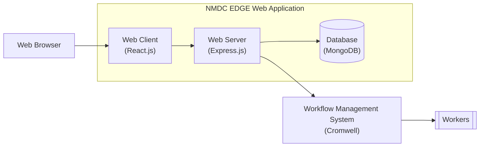
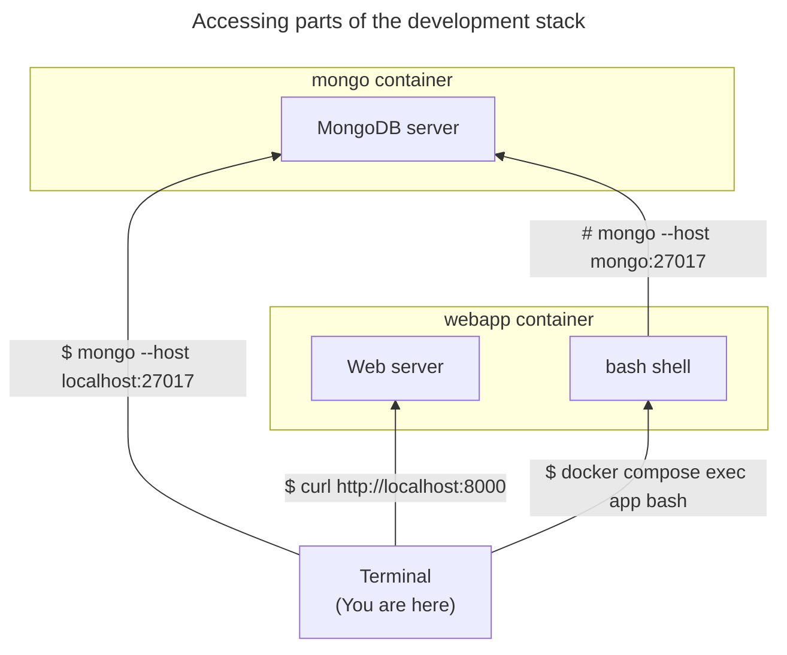

# nmdc-edge

This repository contains the source code of the NMDC EDGE web application.

The NMDC EDGE web application is the web-based interface through which researchers can access the NMDC EDGE platform. 
The NMDC EDGE platform is a [Cromwell](https://cromwell.readthedocs.io/en/stable/)-based system researchers can use to
process omics data using standardized bioinformatics workflows.

You can learn more about the NMDC EDGE platform by reading the [NMDC EDGE tutorials](https://nmdc-edge.org/tutorial).

## Architecture

Here's a diagram depicting the architecture of the NMDC EDGE platform,
including how the NMDC EDGE web application fits into it.



Here's a list of the main technologies upon which the NMDC EDGE web application is built:

- [React.js](https://react.dev/) (web client)
- [Node.js](https://nodejs.org/en) + [Express.js](https://expressjs.com/) (web server)
- [MongoDB](https://www.mongodb.com/) (database)

## Development

### Development stack

This repository includes a **limited** container-based development stack consisting of two container:
- `webapp` - runs the web app
- `mongo` - runs a MongoDB server

You can use the development stack to run the NMDC EDGE web application locally. The main **limitation** is that
the `webapp` container currently **does not** have access to the local file tree at runtime 
(i.e. the `docker-compose.yml` file does not specify a volume mount for the local file tree).
To work around this limitation, you can **rebuild the container image** whenever you want the
development stack to reflect the latest local file tree.

#### Setup

If you have [Docker](https://www.docker.com/products/docker-desktop/) installed on your computer, you can spin up
the development stack by running the following command in the root directory of the repository:

```shell
docker compose up
```

Alternatively, if you've made any changes to the `Dockerfile` since the last time you ran that command,
run it with the `--build` option so those changes take effect.

```shell
docker compose up --build
```

#### Usage

Once the development stack is up and running, you can access various pieces of it from your computer as shown here:



## Deployment

Coming soon...